# agentic-OS Architecture Diagrams

## System Overview

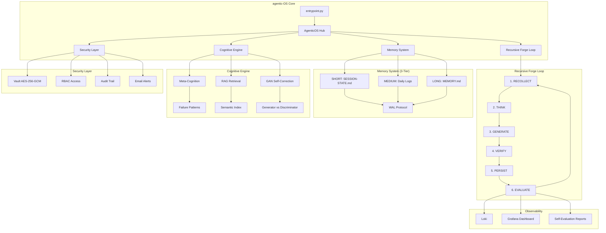

## Recursive Loop Flow

```mermaid
flowchart LR
    subgraph Loop["Recursive Forge Loop"]
        direction TB
        A[RECOLLECT] --> B[THINK]
        B --> C[GENERATE]
        C --> D[VERIFY]
        D --> E{PASS?}
        E -->|Yes| F[PERSIST]
        E -->|No| G[Record Error]
        G --> A
        F --> H[EVALUATE]
        H --> A
    end
    
    A:Load state from SQLite
    A:Check memory context
    
    B:RAG retrieves memories
    B:Analyze patterns
    
    C:GAN generates code
    C:Discriminator scores
    
    D:Execute in Docker sandbox
    D:Check for errors
```

## GAN Self-Correction

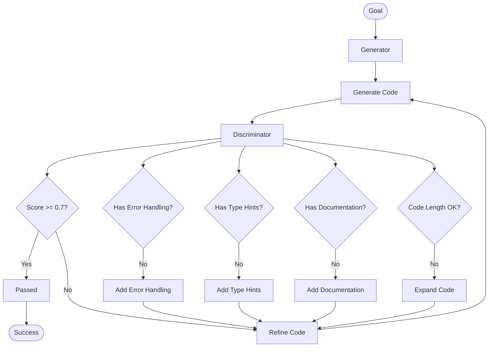

## Memory Architecture

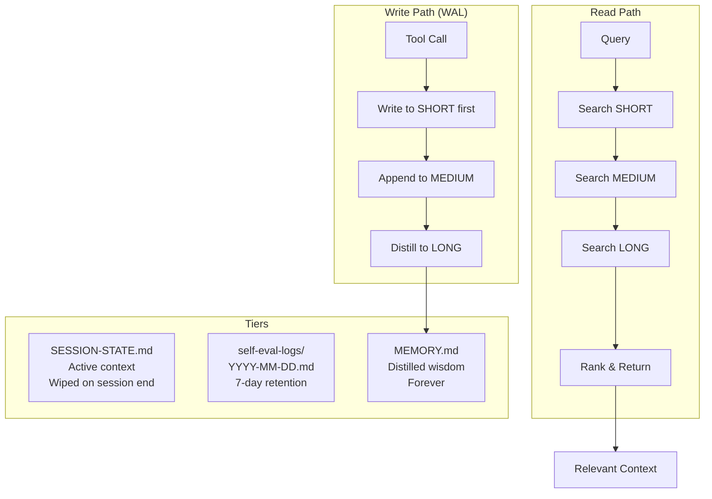

## Cognitive Engine

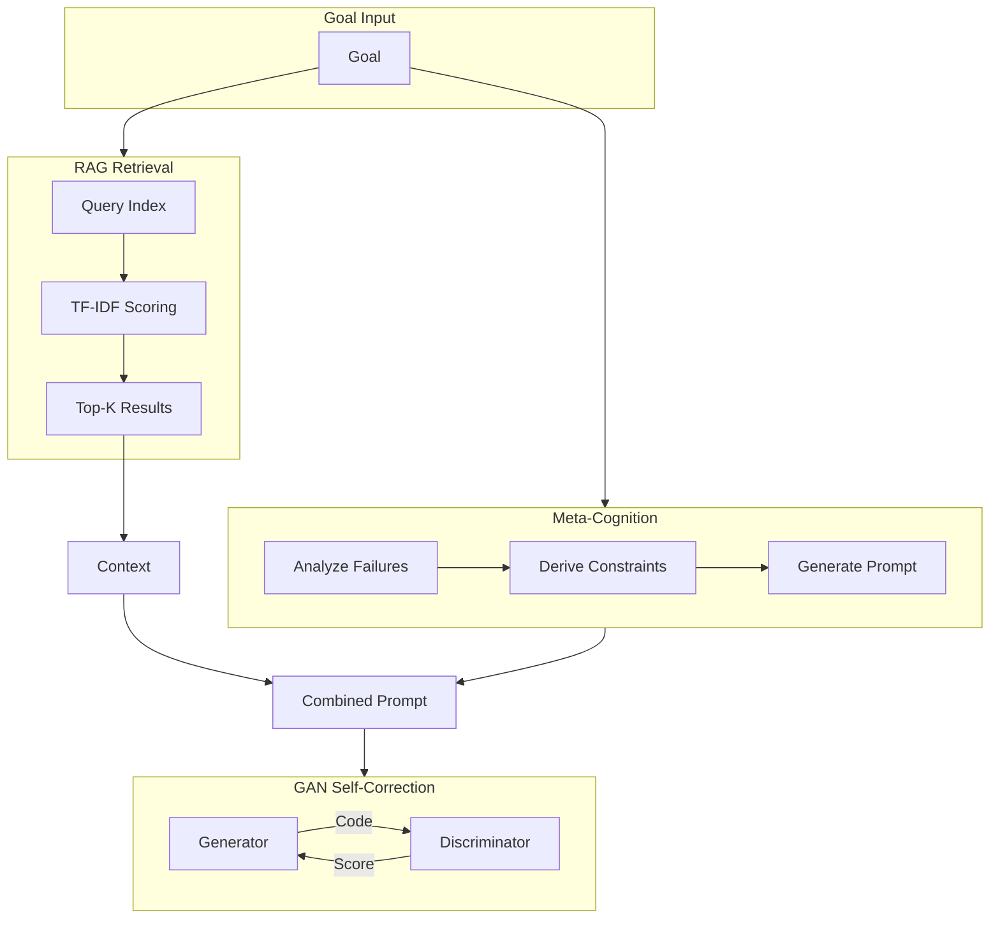

## Security Architecture

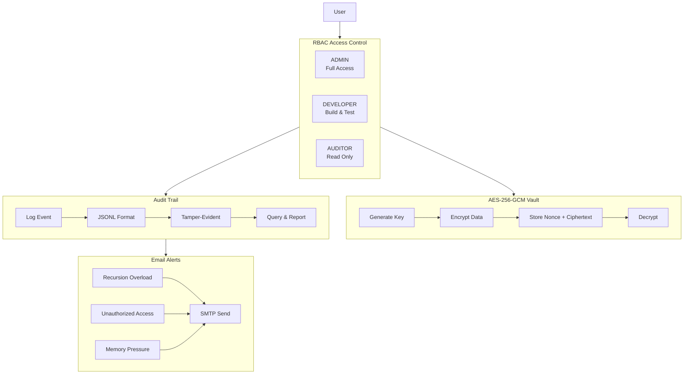

## Docker Stack

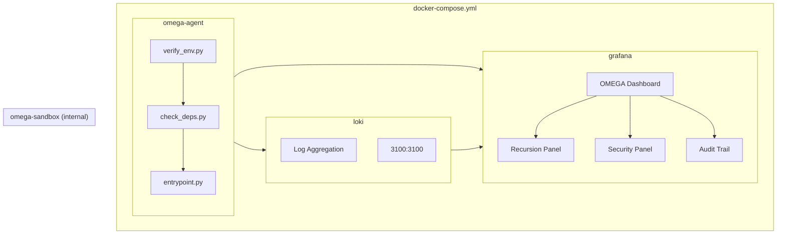

## State Persistence

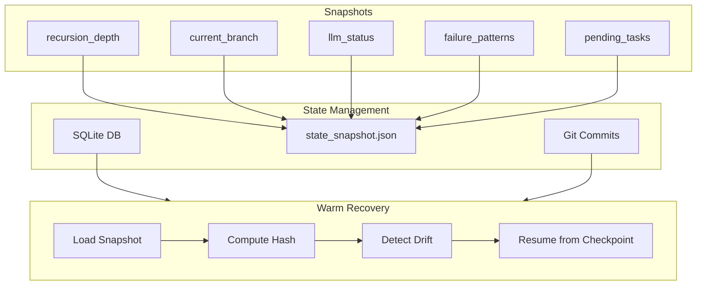

## User Interaction Flow

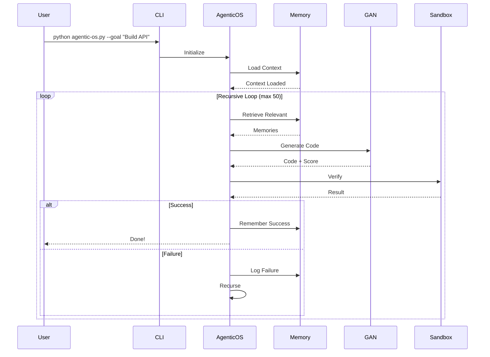

## Observability Flow

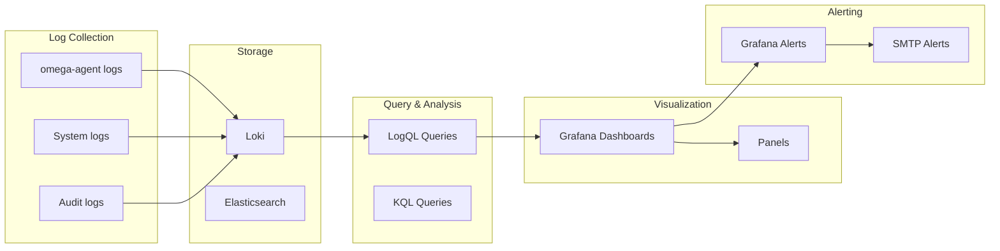

## Meta-Cognition Pattern Analysis

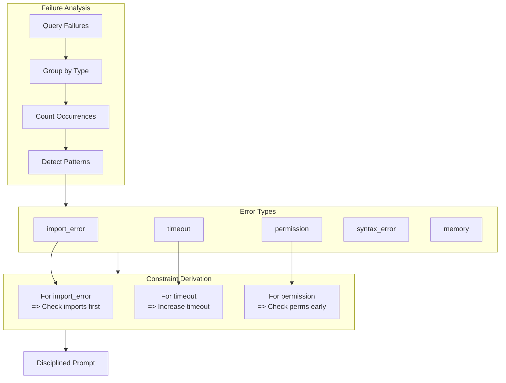

## Complete System Data Flow

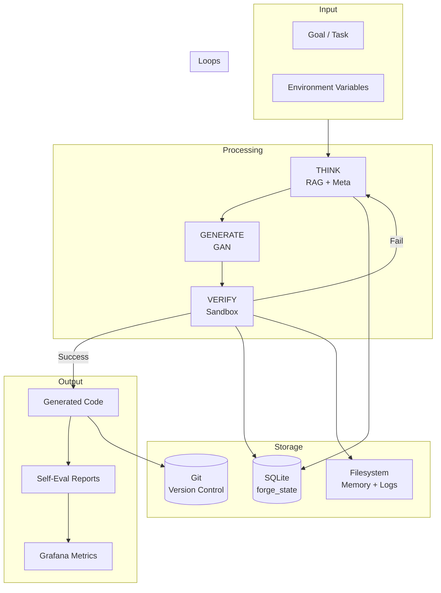

## Self-Development Loop

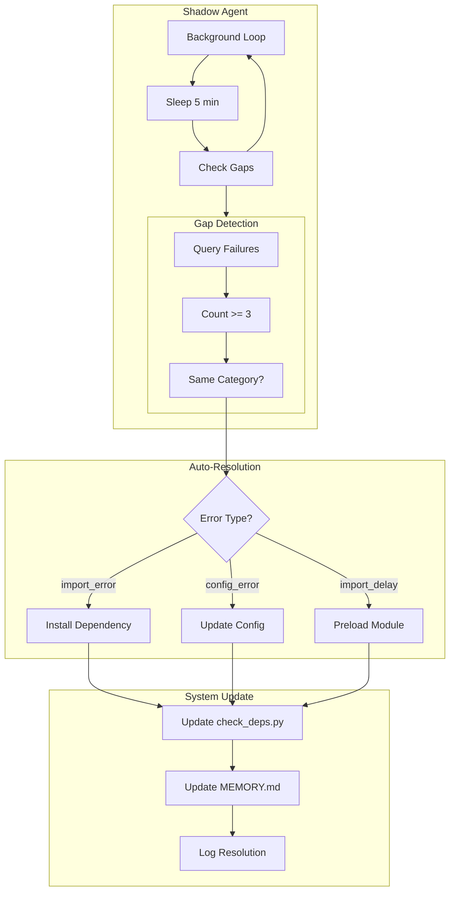
