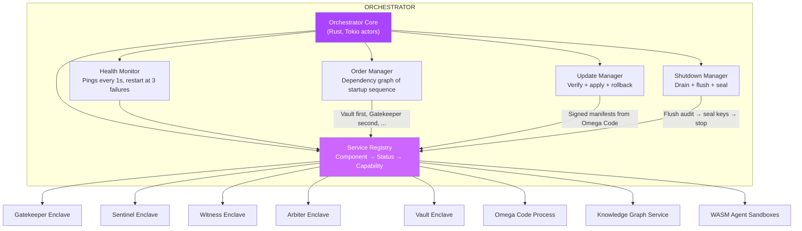
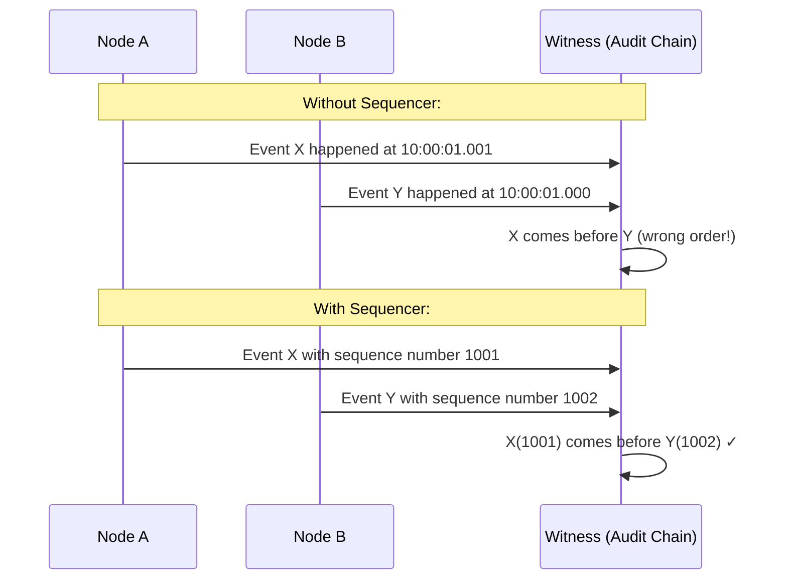
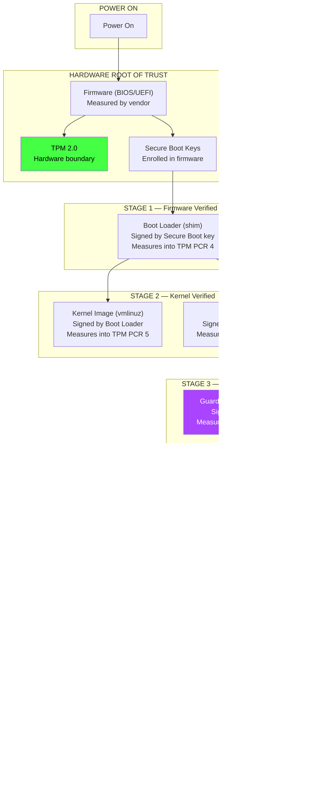
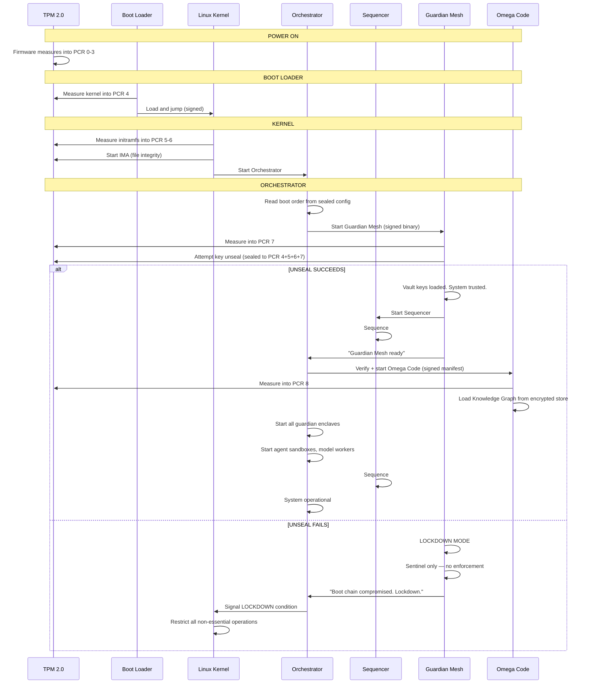

# agentic-OS: Sequencer, Boot, Orchestrator & Kernel Security

> The four components that actually make the system hold together.
> Without these, everything else is decoration.

---

## 1. The Four Missing Components

```
┌─────────────────────────────────────────────────────────────────────────┐
│                                                                           │
│  ┌───────────────────────────────────────────────────────────────────┐  │
│  │                    THE ORCHESTRATOR                                 │  │
│  │  "I decide what runs, when, and in what order."                     │  │
│  │  Manages lifecycle of: Guardian Mesh, Omega Code, Knowledge Graph,  │  │
│  │  agent sandboxes, model workers, peripherals.                       │  │
│  └────────────────────────────────┬──────────────────────────────────┘  │
│                                    │                                      │
│  ┌────────────────────────────────┼──────────────────────────────────┐  │
│  │              THE SEQUENCER     │                                   │  │
│  │  "I ensure every event has a   │                                   │  │
│  │   unique, total order."        │                                   │  │
│  │  Lamport clocks + hybrid       │                                   │  │
│  │   logical clocks for ordering  │                                   │  │
│  │   across all components.       │                                   │  │
│  └────────────────────────────────┴──────────────────────────────────┘  │
│                                    │                                      │
│  ┌────────────────────────────────┼──────────────────────────────────┐  │
│  │              THE BOOT LOADER   │                                   │  │
│  │  "I verify and load every      │                                   │  │
│  │   component, in the right      │                                   │  │
│  │   order, with cryptographic    │                                   │  │
│  │   chain-of-trust."             │                                   │  │
│  └────────────────────────────────┴──────────────────────────────────┘  │
│                                    │                                      │
│  ┌────────────────────────────────┼──────────────────────────────────┐  │
│  │          KERNEL SECURITY       │                                   │  │
│  │  (TPM / Measured Boot /        │                                   │  │
│  │   Attack Resistance)           │                                   │  │
│  │  "I make the boot chain        │                                   │  │
│  │   tamper-evident and           │                                   │  │
│  │   cryptographically provable." │                                   │  │
│  └────────────────────────────────┴──────────────────────────────────┘  │
│                                                                           │
└─────────────────────────────────────────────────────────────────────────┘
```

---

## 2. The Orchestrator — "The Conductor"

### What It Is

A lightweight Rust process that runs **inside** the Guardian Mesh as a privileged-but-limited enclave. It does not enforce policy (that's the Gatekeeper). It does not observe (that's the Sentinel). It manages lifecycle.

### What It Does

| Responsibility | How | Why It Matters |
|---------------|-----|----------------|
| **Boot ordering** | Starts Guardian Mesh enclaves in dependency order: Vault → Gatekeeper → Witness → Sentinel → Arbiter | Vault must be ready to issue tokens before Gatekeeper can evaluate |
| **Service registry** | Maintains a list of every running component, its health, its capability scope | Guardian Mesh needs to know "who is allowed to call what" |
| **Health monitoring** | Pings every component every 1s. If 3 consecutive pings fail → restart. | Dead enclave = security hole |
| **Graceful degradation** | If Vault dies: system enters read-only mode. If Sentinel dies: Gatekeeper uses last-known policy. If Gatekeeper dies: all actions BLOCK by default. | System never operates without guardians |
| **Updates** | Receives signed update manifests from Omega Code. Verifies signatures. Stops component. Replaces binary. Starts component. | Atomic, verifiable updates |
| **Rollback** | On update failure: restores previous version from sealed backup. | Never stuck with broken update |
| **Shutdown** | Drains in-progress operations. Flushes Witness audit chain. Seals Vault keys. Signals kernel for poweroff. | No data loss on shutdown |

### Architecture



### Orchestrator Design Rules

```
1. The Orchestrator does NOT evaluate policy. (That's the Gatekeeper.)
2. The Orchestrator does NOT observe anomalies. (That's the Sentinel.)
3. The Orchestrator does NOT make security decisions.
4. The Orchestrator only manages lifecycle.
5. If the Orchestrator dies, the last-known-good state persists.
6. The Orchestrator is the ONLY component that can start/stop other components.
7. The Orchestrator itself is verified by the TPM at boot (measured boot chain).
```

---

## 3. The Sequencer — "The Clock"

### What It Is

A distributed logical clock that assigns a unique, total order to every event in the system. Without it, two components on different nodes cannot agree on "what happened first."

### Why It Exists



### How It Works

```
Every event in the system carries a Hybrid Logical Clock (HLC) timestamp:

  HLC = (physical_wall_clock, logical_counter, node_id)

  - physical_wall_clock: NTP-synced Unix millis (for human readability)
  - logical_counter: monotonic counter, incremented on every event
  - node_id: unique per node (for tiebreaking)

  Total ordering: compare physical_clock, then logical_counter, then node_id.
  Always produces a unique, total order across all nodes.
```

### What Gets Sequenced

| Event | Sequenced By | Used By |
|-------|-------------|---------|
| Every EvaluateRequest | Sequencer | Witness audit chain ordering |
| Every EvaluateResponse | Sequencer | Witness audit chain correlation |
| Every policy update | Sequencer | Gatekeeper — apply in order |
| Every KG write | Sequencer | Knowledge Graph — causal consistency |
| Every build artifact | Sequencer | Omega Code — build ordering |
| Every enclave message | Sequencer | Handshake Bus — message ordering |
| Every boot event | Sequencer | Boot Loader — boot sequence record |

### Sequencer Design

```rust
// Notional — runs inside Guardian Mesh
struct HybridLogicalClock {
    physical: u64,    // Unix millis (NTP-synced)
    logical: u64,     // Monotonic counter per node
    node_id: u16,     // Unique per node
}

impl Sequencer {
    fn next_timestamp(&mut self) -> HlcTimestamp {
        let now = get_ntp_time_millis();
        // If physical clock advanced: reset logical counter
        if now > self.physical {
            self.physical = now;
            self.logical = 0;
        } else {
            self.logical += 1;
        }
        HlcTimestamp { physical: self.physical, logical: self.logical, node_id: self.node_id }
    }
}
```

---

## 4. The Boot Loader — "The First Breath"

### The Chain of Trust



### What Each Stage Does

| Stage | What Happens | What If It Fails | Attack Vector Blocked |
|-------|-------------|-------------------|----------------------|
| **Power On** | CPU starts at reset vector. Firmware initializes hardware. | Dead system. No recovery. | N/A |
| **Firmware** | UEFI measures itself into TPM PCR 0-3. Checks Secure Boot keys. | Falls back to recovery firmware. | Evil Maid attack (boot from USB) |
| **Boot Loader** | Shim (signed by Microsoft/your key) loads. Measures kernel image into PCR 4. Verifies kernel signature. | Boot loader falls back to known-good version. | Bootkit rootkits |
| **Kernel** | Linux kernel boots with IMA (Integrity Measurement Architecture). Measures every executable into PCR 5-6. | Kernel panic → fallback to previous kernel. | Kernel rootkits (unsigned modules rejected) |
| **Guardian Mesh** | Kernel starts guardian-meshd as PID 1. Guardian Mesh measures itself into PCR 7. Vault attempts to unseal master key. | If key unseal fails → system enters LOCKDOWN mode (no operations allowed). | Kernel-level compromise cannot forge guardian state |
| **Omega Code** | Guardian Mesh verifies Omega Code signature. Starts Omega Code. Omega Code measures into PCR 8. KG key unsealed. | Omega Code crash → Guardian Mesh restarts it. | Tampered Python code cannot load |
| **System Ready** | Orchestrator takes over lifecycle. Sequencer begins. Audit chain records: "System booted successfully at TPM PCR 4+5+6+7+8 = [hash]". | N/A | Full chain-of-trust established |

### The Agentic-OS Twist: Self-Updating the Boot Chain

Conventional systems: boot chain is static. Update requires shutdown + manual install.

agentic-OS: Omega Code can build new boot components, but they must pass the TPM trust chain:

```
1. Omega Code generates a new kernel module: "NVMe encryption driver v2"
2. Omega Code signs it with the current Vault key
3. Guardian Mesh measures the new module into a NEW PCR (PCR 9 = "extended")
4. Vault checks: "Was this module signed by a trusted key?"
   - YES → allow loading. New PCR value recorded.
   - NO → reject. Module not loaded.
5. Kernel loads module. New module is measured. Chain continues.
6. Next boot: PCR 9 value is checked. If it matches, keys unseal normally.
7. If module was tampered: PCR 9 doesn't match → keys don't unseal → system boots in LOCKDOWN.
```

This means: **the system can extend its own boot chain without ever breaking trust.** No existing OS does this. Windows can't. Linux can't. seL4 can't. They all require an external signing authority. agentic-OS IS its own signing authority, and the TPM enforces that nothing untrusted runs.

---

## 5. Kernel Security & Boot-Time Attack Resistance — The Full Depth

### 5.1 TPM Usage Map

| TPM Capability | How We Use It | What It Prevents |
|----------------|---------------|------------------|
| **PCR - Platform Configuration Registers** | 24 PCRs, each measuring a different stage (firmware, bootloader, kernel, initramfs, guardian mesh, omega code, extensions) | Any component tampering is detected |
| **Sealed signing keys** | Vault enclave's ML-DSA-65 private key is sealed to PCR 4+5+6+7+8. Only unsealed if ALL stages are trusted. | Key extraction on compromised system |
| **Remote attestation** | Guardian Mesh can sign a TPM quote (PCR values + nonce) and send it to a remote verifier. | Proves system state to external parties |
| **Monotonic counter** | Used for anti-rollback. Counter increments on each boot. If counter decreases, system detects rollback attack. | Boot rollback attacks (attacker boots old vulnerable version) |
| **NVRAM** | Stores the "golden" PCR values expected for each stage. Compared against actual after each boot component loads. | First-boot integrity establishment |
| **RNG** | Seeds the system's CSPRNG. Used for key generation, nonces, tokens. | Predictable randomness attacks |
| **Secure Boot key enrollment** | Only our key (or Microsoft's, for dual-boot) can sign boot components. All other keys deleted from firmware. | Untrusted boot component loading |

### 5.2 Boot-Time Attack Resistance — Every Attack Vector

| Attack Vector | Stage | How We Stop It | Detection Method |
|--------------|-------|---------------|-----------------|
| **Evil Maid** (attacker replaces boot with malicious USB) | Firmware | Secure Boot: firmware checks signature. TPM: PCR 0-3 don't match golden value. | Boot fails. Keys don't unseal. |
| **Bootkit** (attacker modifies boot loader on disk) | Stage 1 | Boot loader is signed. Signature verification before load. TPM PCR 4 checked. | System fails to boot. |
| **Kernel rootkit** (attacker replaces kernel image) | Stage 2 | Kernel image is signed. IMA measures every executable. TPM PCR 5 checked. | Kernel panic or LOCKDOWN mode. |
| **Initramfs tampering** (attacker modifies initramfs scripts) | Stage 2 | Initramfs is signed. Measured into PCR 6. | Vault keys don't unseal. |
| **Guardian Mesh replacement** (attacker replaces guardian-meshd binary) | Stage 3 | Binary is signed. Measured into PCR 7. Golden value mismatch. | Vault refuses to unseal. LOCKDOWN. |
| **Omega Code tampering** (attacker modifies Python files) | Stage 4 | Manifest has SHA-256 of every file. Measured into PCR 8. | Guardian Mesh refuses to start Omega Code. |
| **Key extraction** (attacker dumps RAM to extract signing keys) | Any | Vault keys sealed to TPM. Never in plaintext on disk. Only decrypted inside Vault enclave memory. | Keys cannot be extracted from disk or RAM dump. |
| **Boot rollback** (attacker boots old vulnerable kernel) | Stage 2 | TPM monotonic counter: if counter decreases, rollback detected. | System refuses to boot old version. |
| **DMA attack** (attacker uses PCIe device to read kernel memory) | Runtime | IOMMU enabled. Guardian Mesh's Vault marks its memory as DMA-inaccessible. | Vault memory cannot be read by DMA. |
| **Cold boot attack** (attacker freezes RAM to read encryption keys) | Runtime | Vault keys are in CPU registers, not RAM. On power loss, registers clear. | Keys destroyed on power loss. |
| **Kernel memory dump** (attacker forces kernel crash dump to read Vault memory) | Runtime | Vault memory is not included in crash dumps (memblock reserve). | No key material in crash dumps. |

### 5.3 LOCKDOWN Mode — When Boot Fails

If ANY stage of the boot chain fails verification, the system enters LOCKDOWN:

```
LOCKDOWN BEHAVIOR:
1. Guardian Mesh starts in degraded mode (Sentinel only — no Gatekeeper, no Vault)
2. Sentinel can observe but NOT block anything
3. No derived tokens can be issued (Vault keys not unsealed)
4. Omega Code does NOT start
5. Audit chain records: "SYSTEM LOCKDOWN: PCR 5 mismatch"
6. User sees: "System integrity check failed. Cannot proceed."
7. User must either:
   a. Restore known-good boot components (from Omega Code's signed backups)
   b. Re-seal Vault keys to new PCR values (if the change was intentional)
   c. Reinstall from signed recovery image

LOCKDOWN is NOT bypassable by any software. Only the TPM can unseal.
```

### 5.4 Remote Attestation — Proving Trust to Third Parties

Other nodes or administrators can verify the system's boot state:

```
Verifier: "Prove you booted with trusted components."
agentic-OS:  "Here is a TPM quote signed by the hardware key:
             PCR 4 = abcd... (boot loader hash)
             PCR 5 = ef01... (kernel hash)
             PCR 6 = 2345... (initramfs hash)
             PCR 7 = 6789... (guardian mesh hash)
             PCR 8 = abcd... (omega code hash)
             Nonce: 12345678 (fresh, from verifier)
             Signature: <ML-DSA-65 signed by TPM's attestation key>"

Verifier: "All PCR values match the golden manifest.
           This system booted with trusted components.
           I can trust its responses."
```

This is how a cluster of agentic-OS nodes can verify each other before forming a trusted mesh.

---

## 6. How The Four Components Work Together



---

## 7. The Single Most Important Design Decision

The Orchestrator, Sequencer, and Boot Loader must be **Rust, statically linked, <1MB, and live in the Guardian Mesh's signed container image**. They are NOT part of the Omega Code. They are NOT written in Python. They are:

- Boot Loader: measured by TPM
- Orchestrator: verified by Boot Loader
- Sequencer: started by Orchestrator

This creates an **unbroken chain of trust from the TPM to the Sequencer**. The Omega Code (Python) is ABOVE this chain — it can build new versions of components, but it cannot modify the chain itself without TPM re-sealing.

```
TPM → Boot Loader → Kernel → Orchestrator → Guardian Mesh → Sequencer
                                                              │
                                                    Omega Code (above, not in chain)
                                                    can build new components but
                                                    cannot forge the chain itself
```
