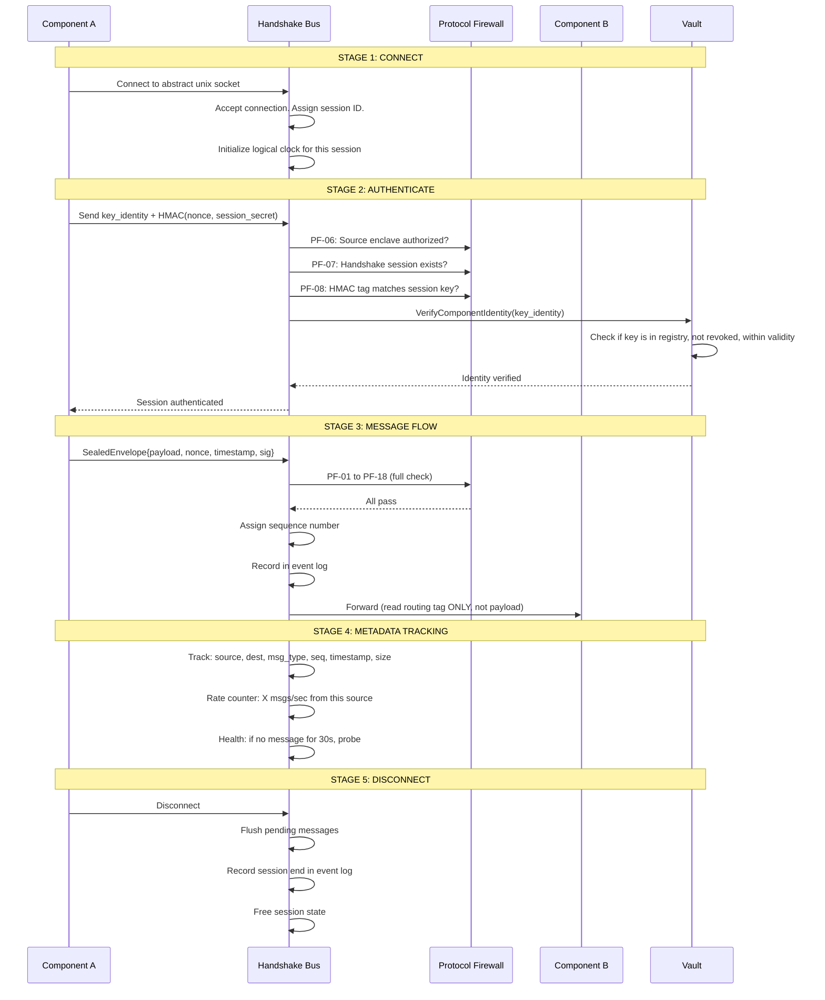

# agentic-OS: Data, Keys, Registries, Supervision & Build Quality

> The complete data and metadata infrastructure that makes the architecture real.
> Databases, records, registries, PKI, handshake state, kernel supervision, failsafe patterns.

---

## 1. Database Architecture — What Stores What

```
┌──────────────────────────────────────────────────────────────────────────────┐
│                      STORAGE LAYER OVERVIEW                                    │
│                                                                                │
│  Each component uses the storage engine appropriate to its data:               │
│                                                                                │
│  COMPONENT          STORAGE          DATA                           PERSIST   │
│  ────────────────────────────────────────────────────────────────────────     │
│  Knowledge Graph    sled + vector    3-tier knowledge graph          SSD      │
│  Witness            file (append)    Blake3 hash chain + proofs     SSD      │
│  Vault              TPM + file       Sealed keys (encrypted)        TPM+SSD  │
│  Gatekeeper         file (mmap)      Compiled policy decision tree  SSD      │
│  Omega Code         SQLite + file    State, checkpoints, memory     SSD      │
│  Orchestrator       file (JSON)      Service registry, boot order   RAM+SSD  │
│  Sequencer          file (mmap)      Last sequence number           RAM+SSD  │
│  Protocol Firewall  RAM              Nonce window, rate counters    RAM       │
│  Sentinel           RAM + file       Baseline behavior model        SSD       │
│  Build Provenance   file (JSON)      Build manifests + hashes       SSD       │
└──────────────────────────────────────────────────────────────────────────────┘
```

### 1.1 The Six Storage Engines

| Engine | Used By | Why This One | Durability |
|--------|---------|-------------|------------|
| **sled** (embedded DB) | Knowledge Graph | ACID, crash-safe, MVCC, zero-admin, Rust-native | fsync on every write |
| **Append-only file** | Witness audit chain | Chain is immutable by design. Write once, read never (except verify). | fsync per entry |
| **mmap'd file** | Gatekeeper policy, Vault key store | Zero-copy read. Policy is read-only at runtime. Keys read once at boot. | MAP_SYNC |
| **SQLite** | Omega Code state, checkpoints | Existing. 200+ tests use it. Mature, battle-tested. | WAL mode (async) |
| **JSON file** | Orchestrator registry, build manifests | Human-readable for debugging. Small data (<100KB). | fsync on write |
| **TPM NVRAM** | Sealed key material | Hardware boundary. 70% of attacks need the key file; TPM prevents this. | Hardware |

### 1.2 Database Access Rules

```
RULE 1:  No component writes to another component's storage.
         Vault does not write to Witness. Sentinel does not write to Gatekeeper.
         
RULE 2:  All reads go through the component that owns the data.
         If Omega Code needs to verify a proof, it calls Witness VerifyProof gRPC.
         It does NOT read the Witness audit file directly.

RULE 3:  Every write is signed by the writing component.
         Knowledge Graph writes include ML-DSA-65 signature of omega_hierarchical_memory.
         
RULE 4:  Every write is sequenced.
         Sequencer timestamp is embedded in every record.
         
RULE 5:  Storage is encrypted at rest.
         Vault encrypts everything with AES-256-GCM. Key sealed by TPM.
```

### 1.3 Knowledge Graph — Storage Details

```protobuf
message KnowledgeNode {
    string node_id = 1;                    // Blake3 hash of (namespace, key)
    string namespace = 2;                  // "user.john" | "system.boot" | "pattern.compile"
    string key = 3;                        // "preferred.strategy" | "routine.monday"
    bytes value = 4;                       // Encrypted with KG-tier key
    uint64 timestamp_epoch_ms = 5;         // Sequencer timestamp
    uint64 sequence = 6;                   // Sequencer monotonic counter
    uint16 node_id_src = 7;               // Sequencer node ID
    repeated string edges = 8;             // Links to other nodes (for graph traversal)
    double strength = 9;                   // 0.0 (weak) to 1.0 (strong/frequent)
    Signature writer_sig = 15;             // ML-DSA-65 of fields 1-9
}

message KnowledgeEdge {
    string from_node = 1;
    string to_node = 2;
    string relation = 3;                   // "precedes" | "causes" | "prefers" | "follows"
    double weight = 4;                     // 0.0 (rare) to 1.0 (always)
    Signature writer_sig = 15;
}
```

---

## 2. Records — Every Event, Forever

### 2.1 Audit Chain (Witness)

```
┌───────┐    ┌───────┐    ┌───────┐    ┌───────┐
│Entry 1│───►│Entry 2│───►│Entry 3│───►│Entry 4│───► ...
│hash:  │    │hash:  │    │hash:  │    │hash:  │
│abc123 │    │def456 │    │789abc │    │...    │
│prev:  │    │prev:  │    │prev:  │    │prev:  │
│000000 │    │abc123 │    │def456 │    │789abc │
└───────┘    └───────┘    └───────┘    └───────┘
     │            │            │            │
     ▼            ▼            ▼            ▼
Merkle Root ────► External Anchor (every 1000 entries)
                  (published, verifiable, append-only)
```

```protobuf
message AuditEntry {
    uint64 sequence = 1;                   // Monotonic, from Sequencer
    Blake3Hash prev_entry_hash = 2;        // Link to previous entry (chain)
    Blake3Hash event_hash = 3;            // Blake3(evaluate_request || evaluate_response)
    uint64 timestamp_epoch_ms = 4;         // Sequencer timestamp
    uint16 node_id = 5;                    // Originating node
    VerdictType verdict = 6;               // ALLOW | BLOCK | THROTTLE | ESCALATE
    Blake3Hash reason_hash = 7;           // Reason for verdict (opaque)
    Signature witness_sig = 15;            // ML-DSA-65 signed
}

// Verifying integrity:
// For entry N: recompute Blake3(event_N), compare to event_hash
// Verify chain: hash(N) == Blake3(N-1_hash || event_hash || timestamp)
// Verify no gaps: sequence_N == sequence_{N-1} + 1
```

### 2.2 Event Log (Sequencer)

All events carry a sequencer timestamp. This is not an append log — it's a **distributed ordering grid**:

```protobuf
message SequencedEvent {
    uint64 wall_clock = 1;      // NTP-synced Unix millis
    uint32 logical_clock = 2;   // Monotonic per node
    uint16 node_id = 3;         // Originating node
    uint32 event_type = 4;      // BOOT | EVALUATE | BUILD | UPDATE | SHUTDOWN | FAILURE
    Blake3Hash event_hash = 5;  // Hash of the event payload
}

// Total ordering: sort by (wall_clock, logical_clock, node_id)
// Always unique across all nodes.
// Proof: event_A happened before event_B if:
//   wall_A < wall_B, OR
//   wall_A == wall_B AND logical_A < logical_B, OR
//   wall_A == wall_B AND logical_A == logical_B AND node_A < node_B
```

### 2.3 State Snapshots (Orchestrator + Omega Code)

| Component | Snapshots | Frequency | Retention |
|-----------|-----------|-----------|-----------|
| Orchestrator | Service state, boot order, health status | Every 10s + on change | Last 100 |
| Omega Code | Checkpoint (from state_manager.py) | On every build cycle | Last 50 |
| Knowledge Graph | Tier-3 (long-term) snapshot | Daily | Last 365 |
| Gatekeeper | Policy decision tree | On update only | Last 2 (current + previous) |
| Vault | Key metadata (NOT keys) | On rotation | Last 2 |

---

## 3. Registries — The System's Knowledge of Itself

### 3.1 Capability Registry (Gatekeeper)

```protobuf
message CapabilityRule {
    ActionType action = 1;               // CODE_EXECUTE, FILE_WRITE, etc.
    string resource_pattern = 2;         // "/home/**", "github.com/*", etc.
    bool allow = 3;                      // true = allow, false = block
    uint32 priority = 4;                 // Higher = evaluated first
    repeated Condition conditions = 5;   // Time-of-day, user-level, etc.
}

message Condition {
    string type = 1;                     // "time_of_day" | "user_skill" | "resource_usage"
    string operator = 2;                 // "lt" | "gt" | "eq" | "in"
    string value = 3;                    // "14:00-16:00" | "expert" | "0.8"
}

// The entire capability registry is compiled into a decision tree at build time.
// No runtime parsing. No runtime updates. Tree is <50KB.
// Loaded by Gatekeeper at boot. Immutable until next build.
```

### 3.2 Service Registry (Orchestrator)

```protobuf
message ServiceEntry {
    string service_name = 1;             // "guardian-mesh.vault" | "omega-code"
    uint32 pid = 2;                      // Process ID
    ServiceStatus status = 3;            // RUNNING | STOPPED | DEGRADED | FAILED
    uint64 started_at = 4;               // Unix epoch ms
    uint64 last_heartbeat = 5;           // Unix epoch ms
    uint32 restart_count = 6;            // Number of restarts (for backoff)
    string capability_scope = 7;         // "guardian" | "builder" | "kg" | "agent"
    repeated Endpoint endpoints = 8;     // gRPC endpoints this service exposes
}

message Endpoint {
    string address = 1;                  // unix socket path or TCP address
    uint32 port = 2;                     // 0 for unix sockets
    string protocol = 3;                 // "grpc" | "raw"
}

// Registry is maintained by Orchestrator.
// All queries go through Orchestrator's gRPC.
// No component reads the registry file directly.
```

### 3.3 Component Registry (Orchestrator + Omega Code)

```protobuf
message ComponentVersion {
    string component_name = 1;           // "guardian-meshd" | "omega-code" | "kernel-module-nvme"
    string version = 2;                  // SemVer: "1.2.3"
    Blake3Hash build_hash = 3;          // SHA-256 of the binary
    uint64 built_at = 4;                 // Unix epoch ms of build time
    string built_by = 5;                 // "omega-code.v1.2.3" (which version built this)
    BuildStatus status = 6;              // DEPLOYED | TESTING | ROLLED_BACK | FAILED
    repeated Blake3Hash signer_chain = 7; // The chain of signatures (for provenance)
    Signature build_sig = 15;            // Omega Vault's signature
}
```

### 3.4 Key Registry (Vault)

```protobuf
message KeyEntry {
    string key_id = 1;                   // "root.vault.2026-06" | "signing.gatekeeper.2026-06"
    KeyType type = 2;                    // ML_DSA_65 | AES_256_GCM | HMAC_SHA256
    KeyStatus status = 3;                // ACTIVE | ROTATED | REVOKED | COMPROMISED
    uint64 created_at = 4;               // Unix epoch ms
    uint64 expires_at = 5;               // Max 90 days from created_at
    Blake3Hash public_key_hash = 6;      // Hash of the public key (for discovery, NOT the key itself)
    string sealed_by = 7;                // "tpm.pcr.4+5+6+7" — which PCR set sealed this
}

// The Vault stores the actual key material in TPM-sealed memory.
// The Key Registry stores metadata only.
// No plaintext key material ever touches disk.
```

---

## 4. Keys & Certificates — The PKI

### 4.1 Key Hierarchy

```
TPM Endorsement Key (hardware, unextractable)
    │
    └── Attestation Key (AIK) — signs TPM quotes for remote verification
         │
         ├── Root Signing Key (sealed to PCR 4+5+6+7)
         │    │  90-day rotation. Sealed by TPM. Never exported.
         │    │
         │    ├── Guardian Mesh Signing Key
         │    │    │  Signs every Guardian Mesh binary and policy update
         │    │    │
         │    │    ├── Gatekeeper Policy Key
         │    │    │    Signs compiled policy decision trees
         │    │    │
         │    │    └── Witness Chain Key
         │    │         Signs each audit entry in the hash chain
         │    │
         │    ├── Omega Code Signing Key
         │    │    │  Signs every Omega Code build artifact
         │    │    │
         │    │    ├── Build Manifest Key
         │    │    │    Signs build manifests (provenance)
         │    │    │
         │    │    └── Knowledge Graph Key
         │    │         Signs KG entries (integrity)
         │    │
         │    └── Session Key Root
         │         Derives ephemeral session keys per handshake
         │
         └── Recovery Key (offline, air-gapped)
              Used ONLY for disaster recovery. Stored on physical media.
              Can override TPM sealing if hardware fails.
```

### 4.2 Key Rotation

| Key | Rotation Period | Method | Impact |
|-----|----------------|--------|--------|
| Root Signing | 90 days | New key generated, sealed. Old key kept for verification. | All derived keys must be re-signed |
| Guardian Mesh Signing | 90 days | Re-sign all guardian binaries | Graceful (binaries verified by old key until replaced) |
| Policy Key | Per update | New key per policy version | None (old policies still verifiable) |
| Session Keys | Per session | Ephemeral — derived and discarded | None |
| Recovery Key | Never (unless compromised) | Physical ceremony | Full system rebuild required |

### 4.3 Certificate Structure

We don't use X.509 for internal operations. We use **raw ML-DSA-65 keys** with a **key ID** derived from Blake3 of the public key:

```protobuf
message KeyIdentity {
    string key_id = 1;              // "v1.2026-06.root-signing" — human-readable alias
    Blake3Hash pub_key_hash = 2;    // Blake3 of the ML-DSA-65 public key
    Blake3Hash issuer_hash = 3;     // Blake3 of the issuer's public key
    uint64 not_before = 4;          // Unix epoch ms
    uint64 not_after = 5;           // Unix epoch ms
    repeated string purposes = 6;   // "signing.binaries" | "signing.audit" | "derive.sessions"
    Blake3Hash revocation_hash = 7; // Blake3 of a revocation statement (if revoked, else 0)
    Signature issuer_sig = 15;      // ML-DSA-65 signed by the parent key
}

// This is NOT X.509. No ASN.1. No BER/DER encoding.
// This is protobuf + ML-DSA-65. Simpler, faster, post-quantum.
// Verifiable by any component that knows the issuer's public key.
```

---

## 5. Handshake & Metadata Management

### 5.1 The Handshake Bus Protocol (Complete)

From the Guardian_Mesh_API formal spec, supplemented with our metadata layer:



### 5.2 Metadata Tracked Per Session

```rust
struct SessionMetadata {
    session_id: u64,
    source_enclave: EnclaveId,       // 0x01-0x05
    source_key_id: String,           // which key authenticated
    connected_at: u64,               // monotonic timestamp
    last_activity: u64,              // monotonic timestamp
    message_count: u64,              // total messages in this session
    byte_count: u64,                 // total bytes in this session
    rate_current: f64,               // msgs/sec in current window
    rate_peak: f64,                  // peak msgs/sec ever
    logical_clock: u64,              // per-session logical clock
    state: SessionState,             // AUTHENTICATING | ACTIVE | DRAINING | CLOSED
}
```

### 5.3 Session Recovery

If a component disconnects and reconnects:

```
1. New session created with new session_id
2. Previous session's metadata archived
3. New session starts fresh — no "resume" of old session
4. Old session's in-flight messages are discarded
5. Receiver sees a gap in sequence numbers — detects the disconnect
6. Receiver can request re-transmission if needed
```

This prevents **session replay attacks** — an attacker cannot replay an old session because every session has a unique ID and the old ID is rejected.

---

## 6. Kernel Supervisory Systems

### 6.1 The Three Watchdogs

```
┌──────────────────────────────────────────────────────────────────────────┐
│                          WATCHDOG HIERARCHY                                │
│                                                                            │
│  HW Watchdog (TPM/BIOS) — 30s timeout                                     │
│    │  If kernel hangs: reset system                                       │
│    │  Immune to software tampering (runs in firmware)                     │
│    ▼                                                                       │
│  Kernel Watchdog (Linux NMI watchdog) — 10s timeout                      │
│    │  If CPU deadlock: panic + reboot                                     │
│    │  Triggers on: spinlock hung, interrupt storm, RCU stall              │
│    ▼                                                                       │
│  Guardian Mesh Watchdog (Orchestrator) — 5s heartbeat interval           │
│    │  If component unresponsive: restart component                        │
│    │  Pings every component every 1s. 3 misses = restart.                 │
│    │  If Orchestrator itself unresponsive: Sentinel escalates             │
│    ▼                                                                       │
│  Omega Code Watchdog (Guardian Mesh) — 30s heartbeat interval           │
│    If Omega Code unresponsive: restart Omega Code                         │
│    Omega Code must call Health() every 30s to stay alive                  │
└──────────────────────────────────────────────────────────────────────────┘
```

### 6.2 Health Check Protocol

```protobuf
// Every component implements this. Called by Orchestrator every 1s.
service Health {
    rpc Ping(PingRequest) returns (PingResponse);
}

message PingRequest {
    uint64 sequence = 1;         // From Sequencer
    uint64 sent_at = 2;          // Sender's monotonic clock
}

message PingResponse {
    uint64 request_sequence = 1; // Echo of request sequence
    uint64 received_at = 2;      // Receiver's monotonic clock
    uint64 responded_at = 3;     // Receiver's monotonic clock
    ComponentStatus status = 4;  // HEALTHY | DEGRADED | FAILING | TERMINATED
    // If DEGRADED: includes details
    string degraded_reason = 5;  // "disk 85% full" | "memory 90% used"
}
```

### 6.3 Failure Mode Matrix (Complete)

For each component, document: crash, hang, compromise, storage full, dependency down, corrupt state, resource exhaustion, recovery path, documented in plan, test coverage.

| Component | Crash | Hang | Compromise | Storage | Dependency | Corrupt | Resource | Recovery | In Plan? | Test? |
|-----------|-------|------|------------|---------|------------|---------|----------|----------|----------|-------|
| **Protocol Firewall** | _New_ | _New_ | **CRITICAL** | RAM only | Vault | _New_ | _New_ | _New_ | Phase 0.8 | _New_ |
| **Sentinel** | DEGRADED | _New_ | **CRITICAL** | LOW | KG | _New_ | _New_ | KG snap | Phase 0.6 | _New_ |
| **Gatekeeper** | FAIL-TO-BLOCK | _New_ | **CRITICAL** | LOW | Vault | _New_ | VERY LOW | Sealed store | Phase 0.5, 5 | _New_ |
| **Witness** | DEGRADED | _New_ | **CRITICAL** | **ENOSPC** | Sequencer | Partial | _New_ | Resume+gap | Phase 0.4 | _New_ |
| **Arbiter** | DEGRADED | _New_ | **CRITICAL** | LOW | Backend | _New_ | LOW | Restart | Phase 0.7 | _New_ |
| **Vault** | LOCKDOWN | _New_ | **CRITICAL** | LOW | TPM | **CRITICAL** | LOW | Restart | Phase 0.3 | _New_ |
| **Handshake Bus** | SYSTEM HALT | _New_ | **CRITICAL** | RAM only | Vault | _New_ | _New_ | HW reset | Phase 0.15 | _New_ |
| **Omega Code** | DEGRADED | _New_ | **CATASTROPHIC** | **HIGH** | Guardian Mesh | _New_ | **HIGH** | GM restart | Phase 1.1 | _New_ |
| **Knowledge Graph** | DEGRADED | _New_ | **CATASTROPHIC** | **HIGH** | Omega+Seq | **HIGH** | MEDIUM | Snapshot | Phase 2.8 | _New_ |
| **Orchestrator** | FROZEN | _New_ | **CRITICAL** | LOW | GM | **HIGH** | LOW | HW reset | Phase 0.2 | _New_ |
| **Sequencer** | DEGRADED | _New_ | **HIGH** | LOW | NTP | MEDIUM | LOW | Last seq | Phase 0.12 | _New_ |
| **Boot Loader** | Fallback | _New_ | LOCKDOWN | MEDIUM | TPM | LOCKDOWN | LOW | Recovery key | Phase 2.1-2.7 | _New_ |
| **TPM** | Passphrase | _New_ | **CRITICAL** | **HIGH** | SPI bus | **CRITICAL** | **LONG TERM** | Recovery key | Phase 2.3 | _New_ |
| **Argent (ZKP vault)** | Phase 1.2 | _New_ | _New_ | _New_ | GM | _New_ | _New_ | _New_ | Phase 1.2 | _New_ |
| **AxiomCode (proof)** | Phase 1.3 | _New_ | _New_ | _New_ | GM | _New_ | _New_ | _New_ | Phase 1.3 | _New_ |
| **Aetheris (gateway)** | Phase 1.4 | _New_ | _New_ | _New_ | GM | _New_ | _New_ | _New_ | Phase 1.4 | _New_ |
| **Nexus (search)** | Phase 1.5 | _New_ | _New_ | _New_ | GM | _New_ | _New_ | _New_ | Phase 1.5 | _New_ |
| **LocalForge (agents)** | Phase 1.6 | _New_ | _New_ | _New_ | GM | _New_ | _New_ | _New_ | Phase 1.6 | _New_ |
| **PAE (analytics)** | Phase 1.7 | _New_ | _New_ | _New_ | GM | _New_ | _New_ | _New_ | Phase 1.7 | _New_ |

Cells marked **CRITICAL** or **CATASTROPHIC** indicate failure modes that must be mitigated before the component enters production. Cells marked _New_ are placeholders for Phase -1 analysis. The full 190-cell completion is a Phase -1 deliverable.

### 6.4 Highest-Risk Unaddressed Failures

| Rank | Failure | Risk | Description |
|------|---------|------|-------------|
| 1 | Omega Code compromise → malicious code signed/deployed | CATASTROPHIC | Self-propagating supply chain attack. Builder is compromised → everything built from that point is malicious. No independent verification path. |
| 2 | Knowledge Graph data poisoning | CATASTROPHIC | Sentinel feeds KG → KG feeds Gatekeeper policy. Poisoned KG makes malicious actions appear normal. Slow-burn compromise over weeks. |
| 3 | Witness chain ENOSPC / unbounded growth | CRITICAL | "Every event, forever" with no retention policy. Eventual disk full with undefined behavior. |
| 4 | Key registry corruption during rotation | CRITICAL | 90-day rotation. Crash mid-rotation could leave old key revoked and new key not persisted. Catastrophic key loss. |
| 5 | TPM NVRAM exhaustion | CRITICAL | Limited NVRAM (32-128KB). No monitoring. Exhaustion prevents new key sealing. |
| 6 | Orchestrator runtime compromise | CRITICAL | Only component that starts/stops everything. Boot-time TPM protects boot, not runtime. |
| 7 | Recursive worker fork bomb | HIGH | No limit on worker spawning. Bug in meta-learning loop could cascade workers building workers. |
| 8 | TOCTOU in policy evaluation | HIGH | Token bound to evaluation time, not policy version. Policy change between check and use bypasses new restrictions. |
| 9 | NTP poisoning / clock manipulation | HIGH | HLC relies on NTP. Poisoned NTP breaks event ordering, audit chain, KG causal consistency. |

### 6.5 Crash Recovery — The Deterministic Shutdown Sequence

```
1. Component fails → Orchestrator detects via heartbeat timeout (3s)
2. Orchestrator checks: is this a crash or a hang?
   a. Crash: component process exited. Start new instance.
   b. Hang: component not responding to pings. Send SIGTERM. Wait 5s. Send SIGKILL.
3. Start new instance of failed component
4. New instance reads last checkpoint from storage
5. New instance resumes from checkpoint
6. Witness records: "Component X restarted at T. Gap from T-3s to T."
7. If restart fails 3 times in 60s: system escalates to LOCKDOWN with partial functionality
```

---

## 7. Failsafe Orchestration — Preventing Catastrophe

### 7.1 The Three Safeguards

| Safeguard | What It Prevents | Implementation |
|-----------|-----------------|----------------|
| **Forward-Only Security** | Cannot silently drop to a lower security state | Containment stages only advance. Escalation requires Arbiter + human. Implemented in Gatekeeper. |
| **Crash Counter** | Cannot rapidly restart and crash (fail-loop) | Orchestrator tracks restart count. Exponential backoff: 1s, 2s, 4s, 8s, 16s, 30s max. Resets after 10 minutes of stability. |
| **Boot Counter** | Cannot boot-loop to exhaust TPM unseal attempts | TPM monotonic counter. Unseal fails after 5 attempts. Requires human intervention. |
| **Quorum Gate** | Single node cannot make unilateral security-downgrade decisions | SL-3 and SL-4 require 2-of-3 or 3-of-4 consensus. Overridden only by signed recovery key. |

### 7.2 Safe Boot After Crash

```
1. Power loss / kernel panic / hardware watchdog reset
2. TPM monotonic counter increments
3. Firmware measures boot chain (same as cold boot)
4. Guardian Mesh checks: did counter increment by exactly 1?
   a. YES → normal boot (counter advanced)
   b. NO → possible rollback attack (attacker restored old state)
5. Vault checks: were all PCR values identical to last successful boot?
   a. YES → keys unseal normally
   b. NO → something changed (could be update or tampering)
         i. If change matches expected update (signed manifest): accept, re-seal keys
         ii. If change is unexpected: LOCKDOWN
```

### 7.3 The "Kill Switch" — Emergency Shutdown

For scenarios requiring immediate system halt (physical breach, key compromise, regulatory order):

```
1. Physical kill switch or signed remote command
2. Orchestrator receives KILL signal
3. Orchestrator immediately:
   a. Revokes all Vault-derived tokens (Vault rotates internal state)
   b. Sends TERMINATE containment to all enclaves (stage 6)
   c. Flushes Witness audit chain to disk
   d. Seals Vault keys to a NEW PCR value that can only be unsealed by recovery key
   e. Signals kernel: power off
4. Result: system cannot be restarted without recovery key
   All data encrypted. Vault keys inaccessible. Audit chain preserved.
```

---

## 8. Build Quality — The Self-Verifying Pipeline

### 8.1 Every Build, Forever

```
1. Omega Code generates code (omega_forge)
2. Omega Code scores it (omega_gan — must pass 0.7/1.0)
3. Omega Code compiles it (omega_shell_tools — cargo build)
4. Omega Code signs it (omega_vault — ML-DSA-65)
5. Omega Code records it in build provenance (JSON manifest)
6. Omega Code stores it in component registry
7. Omega Code evaluates it (omega_self_eval — generates report)
8. Guardian Mesh verifies the signature (Vault — VerifyProof)
9. Guardian Mesh tests it (Gatekeeper evaluates a test action)
10. Guardian Mesh accepts it (Orchestrator loads new component)

No action in this chain depends on an external service.
If the internet is down, the build still happens.
If GitHub is down, the build still happens.
If PyPI is down, the build still happens (all deps are vendored).
```

### 8.2 Build Provenance Record

```json
{
  "build_id": "blake3:6a1b2c3d...",
  "component": "guardian-meshd",
  "version": "1.2.3",
  "built_at": "2026-06-03T14:30:00Z",
  "built_by": "omega-code.v1.2.2",
  "source": {
    "repo": "self",
    "commit": "blake3:abc123...",
    "tree_hash": "blake3:def456..."
  },
  "dependencies": [
    {"name": "tonic", "version": "0.14.5", "hash": "sha256:..."},
    {"name": "ml-dsa", "version": "0.1.0", "hash": "sha256:..."}
  ],
  "outputs": [
    {"path": "target/release/guardian-meshd", "hash": "sha256:789abc..."}
  ],
  "builder": {
    "toolchain": "rustc-1.85.0",
    "host": "agentic-os-builder-node-1",
    "build_duration_ms": 47200,
    "reproducible": true
  },
  "signatures": [
    {"key_id": "signing.omega-code.2026-06", "value": "<ML-DSA-65>"},
    {"key_id": "signing.guardian-mesh.2026-06", "value": "<ML-DSA-65>"}
  ]
}
```

### 8.3 Reproducible Build Verification

```
Every build is performed TWICE:

Build 1: primary build (produces binary)
Build 2: independent rebuild (produces binary')
         Same source. Same toolchain. Same environment.
         Run on different node. Different clock. Different entropy.

If hash(binary) == hash(binary'): BUILD IS REPRODUCIBLE ✓
If hash(binary) != hash(binary'): BUILD IS NOT REPRODUCIBLE ✗
    → Omega Code flags the build
    → omega_self_eval investigates the difference
    → If the difference is expected (timestamp embedded in binary):
        strip timestamp, rebuild, re-compare
    → If the difference is unexplained: reject the build
```

### 8.4 Build Quality Metrics (Tracked by omega_self_eval)

| Metric | Target | Measured By |
|--------|--------|-------------|
| Test pass rate | 100% | omega_feedback_loop (all tests pass before build) |
| GAN discriminator score | >= 0.7 | omega_gan (`generate` returns score) |
| Reproducibility | 100% of builds | Dual-build comparison |
| Dependency freshness | No deps > 1 year old | omega_forge manifest checker |
| Binary size | No unexplained bloat | Compare to previous build |
| Build time | < 5 minutes | Orchestrator timer |
| Signature coverage | Every binary signed | omega_vault verifier |
| Audit coverage | Every build step recorded | Witness chain query |

---

## 9. Summary — The Complete Data Infrastructure

```
┌──────────────────────────────────────────────────────────────────────────────┐
│                                                                                │
│  ┌─────────────────────────┐    ┌─────────────────────────────────────────┐  │
│  │  KNOWLEDGE GRAPH (sled)  │    │  AUDIT CHAIN (append file)               │  │
│  │  User patterns, prefs    │    │  Blake3 hash chain, externally anchored  │  │
│  │  Graph DB with edges     │    │  Immutable, tamper-evident              │  │
│  │  3 tiers: ephemeral/     │    │  Every decision recorded forever         │  │
│  │  short/long              │    │                                         │  │
│  └─────────────────────────┘    └─────────────────────────────────────────┘  │
│                                                                                │
│  ┌─────────────────────────┐    ┌─────────────────────────────────────────┐  │
│  │  KEY REGISTRY (Vault)    │    │  COMPONENT REGISTRY (Orchestrator)       │  │
│  │  Key metadata only       │    │  Every component version tracked        │  │
│  │  Actual keys in TPM      │    │  Build provenance per entry             │  │
│  │  90-day rotation          │    │  Signed by omega_vault                  │  │
│  └─────────────────────────┘    └─────────────────────────────────────────┘  │
│                                                                                │
│  ┌─────────────────────────┐    ┌─────────────────────────────────────────┐  │
│  │  CAPABILITY REGISTRY     │    │  SERVICE REGISTRY (Orchestrator)         │  │
│  │  Compiled decision tree  │    │  Every component's status and endpoint  │  │
│  │  Immutable at runtime   │    │  Updated every heartbeat                │  │
│  │  Signed by policy key   │    │  Used by Guardian Mesh for routing      │  │
│  └─────────────────────────┘    └─────────────────────────────────────────┘  │
│                                                                                │
│  ┌─────────────────────────┐    ┌─────────────────────────────────────────┐  │
│  │  OMEGA CODE STATE       │    │  EVENT LOG (Sequencer)                   │  │
│  │  SQLite checkpoints     │    │  Every event, in order, forever          │  │
│  │  Build provenance JSON  │    │  Hybrid Logical Clock ordering           │  │
│  │  Memory snapshots       │    │  Cross-node consistency                  │  │
│  └─────────────────────────┘    └─────────────────────────────────────────┘  │
│                                                                                │
└──────────────────────────────────────────────────────────────────────────────┘
```
