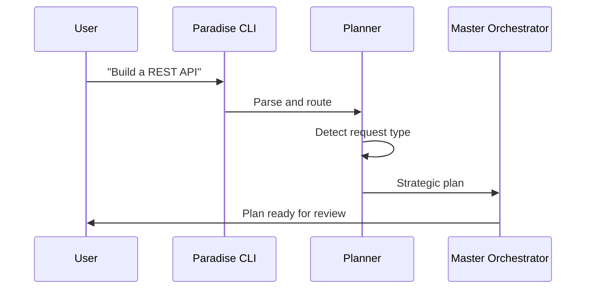
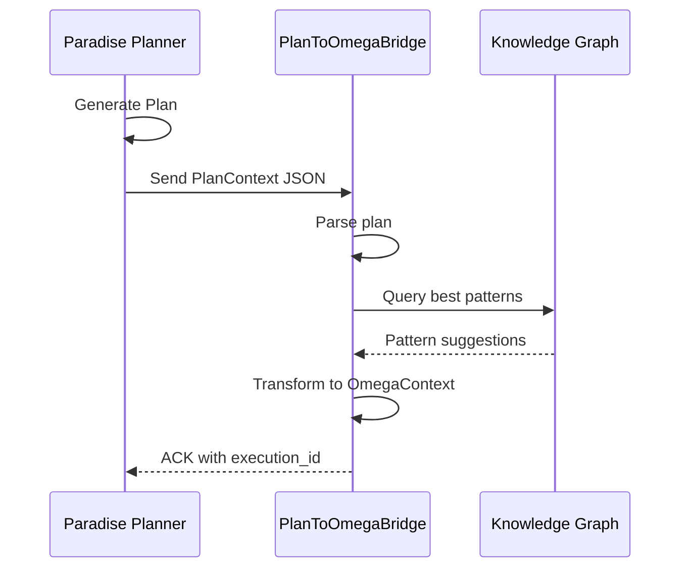
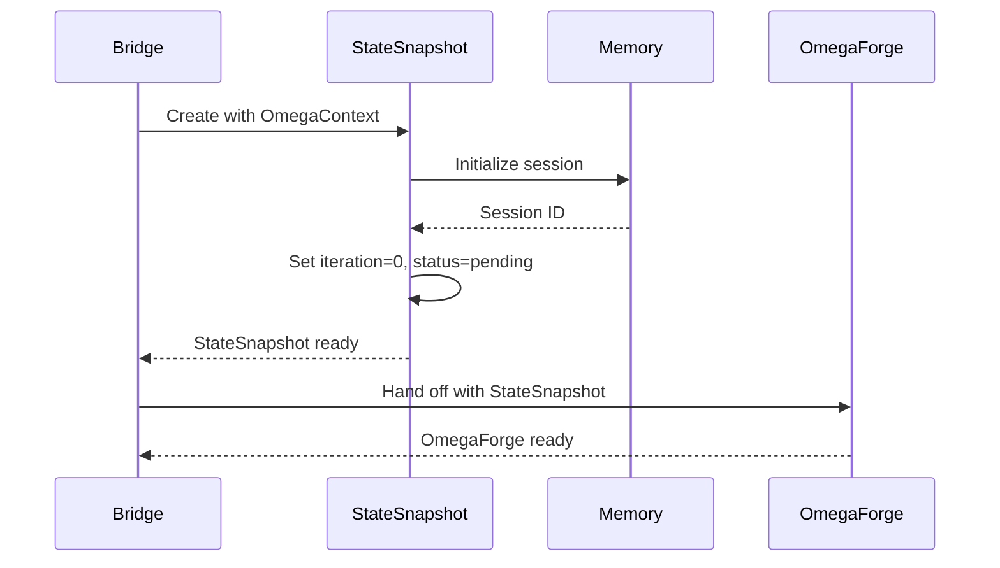
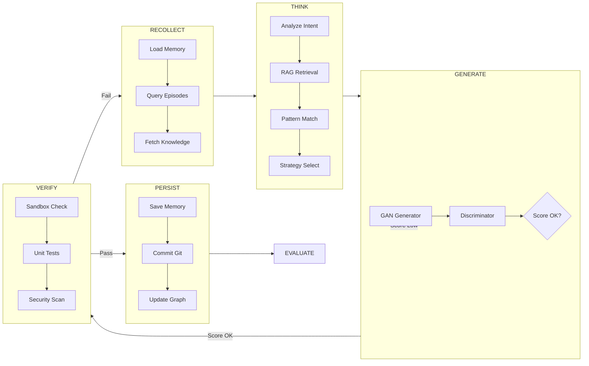
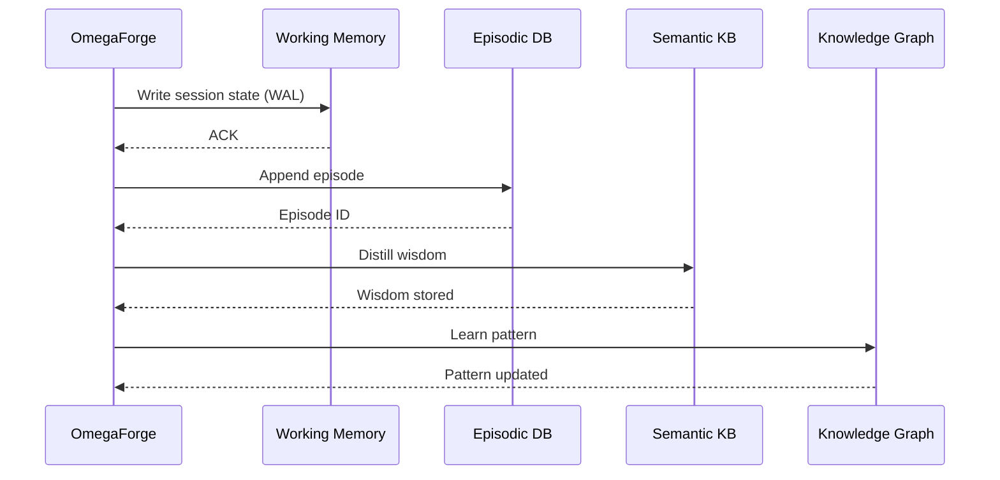
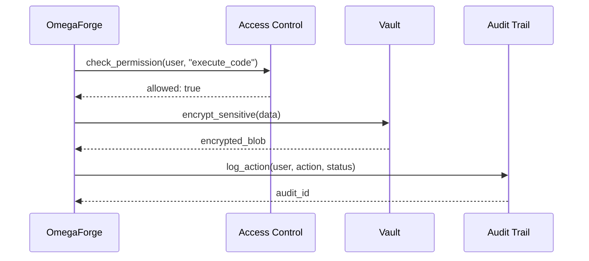
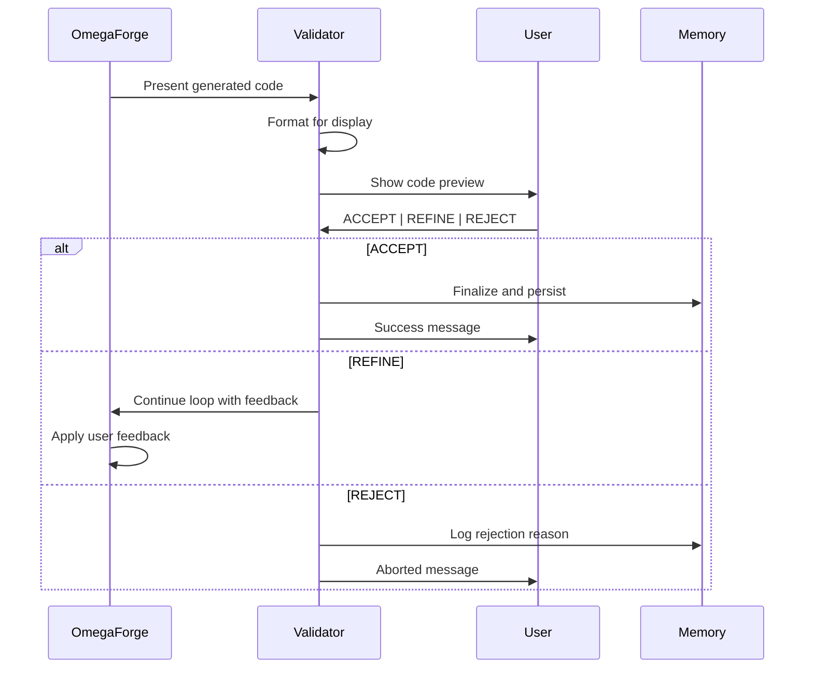

# Component Handshakes & Protocols

Detailed protocol specifications for all component interactions in agentic-OS.

---

## Table of Contents
1. [User → Planning Layer](#1-user--planning-layer)
2. [Planning → Bridge](#2-planning--bridge)
3. [Bridge → Omega](#3-bridge--omega)
4. [Omega Internal Handshakes](#4-omega-internal-handshakes)
5. [Omega → Memory](#5-omega--memory)
6. [Omega → Security](#6-omega--security)
7. [Omega → User Validation](#7-omega--user-validation)
8. [Data Formats](#8-data-formats)

---

## 1. User → Planning Layer

### CLI Input



### Protocol: CLI Command

```json
{
  "command": "paradise plan",
  "args": {
    "goal": "Build a REST API for user authentication",
    "language": "python",
    "framework": "fastapi",
    "interactive": true
  },
  "flags": {
    "--analyze": true,
    "--auto-approve": false
  }
}
```

### Response Format

```json
{
  "status": "plan_ready",
  "plan_id": "plan_20260415_143022",
  "request_type": "api",
  "goal": "Build a REST API for user authentication",
  "detected_framework": "fastapi",
  "steps": [
    "define_schema",
    "implement_routes",
    "add_tests",
    "document"
  ],
  "files_to_create": [
    "src/api.py",
    "src/models.py",
    "tests/test_api.py"
  ],
  "estimated_complexity": "medium"
}
```

---

## 2. Planning → Bridge

### Handshake Protocol



### Plan JSON Schema

```json
{
  "plan_id": "string (UUID)",
  "goal": "string",
  "request_type": "feature_add|bug_fix|refactor|api|frontend|database|auth|test|deploy|ml",
  "steps": ["string"],
  "files_to_create": ["string"],
  "files_to_modify": ["string"],
  "detected_patterns": ["string"],
  "constraints": {
    "language": "string",
    "framework": "string",
    "database": "string"
  },
  "metadata": {
    "source": "paradise_planner",
    "timestamp": "ISO8601",
    "user_id": "string"
  }
}
```

### Bridge ACK Response

```json
{
  "ack": true,
  "execution_id": "exec_20260415_143025",
  "status": "ready",
  "omega_context": {
    "max_iterations": 50,
    "strategy": "contract_first",
    "patterns": ["type:api", "learned:rest_pattern"]
  },
  "subsystems_wired": {
    "meta": true,
    "memory": true,
    "gan": true,
    "rag": true,
    "knowledge_graph": true
  }
}
```

---

## 3. Bridge → Omega

### StateSnapshot Creation



### StateSnapshot Schema

```python
@dataclass
class StateSnapshot:
    state_id: str                    # "exec_20260415_143025"
    iteration: int                    # Current iteration
    goal: str                         # User's goal
    current_code: str                 # Generated code so far
    last_error: Optional[str]         # Last error if any
    status: str                       # pending|running|success|failed
    decisions: List[Decision]         # Track decision history
    patterns: List[str]                # Active patterns
    constraints: List[str]             # Active constraints
    metadata: Dict[str, Any]           # Additional context
```

### Handoff Message

```json
{
  "handoff": "bridge_to_forge",
  "execution_id": "exec_20260415_143025",
  "state_snapshot": { ... },
  "omega_context": { ... },
  "timestamp": "2026-04-15T14:30:25Z"
}
```

---

## 4. Omega Internal Handshakes

### Recursive Loop Phases



### Phase Handshake: RECOLLECT → THINK

```python
# RECOLLECT returns context dict
context = {
    "session_state": "...",      # From Working Memory
    "episodic_history": [...],    # From Episodes DB
    "semantic_knowledge": [...],  # From Semantic KB
    "knowledge_graph": {...},     # From Graph
}

# THINK receives context
def think(context):
    meta_analysis = meta.analyze(context)
    rag_results = rag.retrieve(context["goal"])
    patterns = pattern_matcher.match(rag_results)
    return {..., "context": context, "patterns": patterns}
```

### Phase Handshake: GENERATE → VERIFY

```python
# GENERATE returns code + evaluation
generated = {
    "code": "# Python code...",
    "evaluation": {
        "score": 0.85,
        "passed": True,
        "issues": [],
        "feedback": "Good quality"
    }
}

# VERIFY receives generated code
def verify(generated):
    sandbox_result = docker.run(generated["code"])
    test_result = pytest.run(generated["code"])
    security_result = scan.run(generated["code"])
    
    return {
        "sandbox": sandbox_result,
        "tests": test_result,
        "security": security_result,
        "all_passed": all([sandbox_result, test_result, security_result])
    }
```

### Phase Handshake: VERIFY → USER_VALIDATION

```python
# VERIFY returns validation-ready output
validation_ready = {
    "code": generated["code"],
    "sandbox_status": "passed",
    "test_status": "passed",
    "security_status": "passed",
    "score": generated["evaluation"]["score"],
    "output_files": ["/path/to/file1.py", ...]
}

# USER_VALIDATION prompts user
def validate(validation_ready):
    display(validation_ready["code"])
    choice = prompt_user("[ACCEPT] / [REFINE] / [REJECT]")
    
    return {
        "validation": choice,  # "ACCEPT" | "REFINE" | "REJECT"
        "user_feedback": input("Feedback if refining...")
    }
```

---

## 5. Omega → Memory

### 3-Tier Memory Handshake



### Memory Write Protocol (WAL)

```python
# Write-Ahead Log Protocol
def persist_to_memory(state):
    # 1. Write to WAL immediately (before anything else)
    wal_file = Path(f"memory/wal/{timestamp}.json")
    wal_file.write_text(json.dumps({
        "action": "persist",
        "iteration": state.iteration,
        "data": state.to_dict()
    }))
    
    # 2. Write to Working Memory
    working_memory.write(state)
    
    # 3. Append to Episodic (async)
    episodic.append(state.to_episode())
    
    # 4. Distill to Semantic (async)
    if state.iteration % 10 == 0:
        semantic.distill(state.to_wisdom())
    
    # 5. Update Knowledge Graph
    knowledge_graph.learn(state)
```

### Memory Read Protocol

```python
# Context retrieval for RECOLLECT phase
def recollect(goal):
    # 1. Get recent session state
    recent = working_memory.get_recent()
    
    # 2. Query episodic for similar tasks
    similar_episodes = episodic.query(goal, limit=5)
    
    # 3. Search semantic for relevant patterns
    semantic_results = semantic.search(goal, limit=10)
    
    # 4. Query knowledge graph
    graph_results = knowledge_graph.query(goal, limit=5)
    
    # 5. Combine all context
    return {
        "working": recent,
        "episodes": similar_episodes,
        "semantic": semantic_results,
        "graph": graph_results
    }
```

---

## 6. Omega → Security

### RBAC Handshake



### Permission Check Protocol

```python
def execute_with_permissions(user, action, data):
    # 1. Check RBAC
    if not access_control.check(user, action):
        audit.log_denied(user, action)
        raise PermissionError(f"User {user} cannot {action}")
    
    # 2. Check resource access
    if not access_control.can_access(user, data.resource):
        audit.log_denied(user, f"access:{data.resource}")
        raise PermissionError(f"User {user} cannot access {data.resource}")
    
    # 3. Execute with audit
    try:
        result = execute(action, data)
        audit.log_success(user, action, result)
        return result
    except Exception as e:
        audit.log_failure(user, action, str(e))
        raise
```

### Vault Protocol

```python
# Secure storage for sensitive data
def store_sensitive(key, value, user):
    # 1. Encrypt with AES-256-GCM
    encrypted = vault.encrypt(value)
    
    # 2. Store with access metadata
    vault.store(key, encrypted, {
        "user": user,
        "created": datetime.now(),
        "access": ["ADMIN", "DEVELOPER"]
    })
    
    # 3. Audit the storage
    audit.log_storage(user, key, "encrypted")
    
    return {"status": "stored", "key": key}
```

---

## 7. Omega → User Validation

### Validation Gate Protocol



### Validation Message Format

```python
# Code presentation format
validation_prompt = {
    "type": "validation_request",
    "goal": "Build a REST API",
    "generated_code": {
        "files": [
            {"name": "api.py", "content": "...", "lines": 150},
            {"name": "models.py", "content": "...", "lines": 80}
        ],
        "total_lines": 230
    },
    "metrics": {
        "iterations": 5,
        "gan_score": 0.87,
        "test_coverage": "85%",
        "security_scan": "passed"
    },
    "options": ["ACCEPT", "REFINE", "REJECT"],
    "refine_prompt": "Optional: Enter feedback for refinement..."
}
```

### Validation Response Format

```python
# User response format
validation_response = {
    "choice": "ACCEPT",  # "ACCEPT" | "REFINE" | "REJECT"
    "feedback": None,    # Required if REFINE
    "reason": None,      # Required if REJECT
    "timestamp": "2026-04-15T14:35:00Z"
}
```

---

## 8. Data Formats

### Decision Record

```python
@dataclass
class Decision:
    decision_id: str
    phase: str                    # "RECOLLECT" | "THINK" | "GENERATE" | "VERIFY" | "PERSIST"
    iteration: int
    context: Dict[str, Any]
    options_considered: List[str]
    chosen_option: str
    rationale: str
    outcome: Optional[str]         # "success" | "failure" | "pending"
    timestamp: str
```

### Error Record

```python
@dataclass
class ErrorRecord:
    error_id: str
    iteration: int
    phase: str
    error_type: str               # "SyntaxError" | "TimeoutError" | "SecurityError"
    message: str
    stack_trace: Optional[str]
    recovery_action: str          # "retry" | "skip" | "abort"
    resolved: bool
    timestamp: str
```

### Pattern Record

```python
@dataclass
class PatternRecord:
    pattern_id: str
    pattern_name: str
    pattern_type: str              # "success" | "failure" | "optimization"
    context: Dict[str, Any]
    frequency: int
    success_rate: float
    last_applied: Optional[str]
    metadata: Dict[str, Any]
```

---

## Error Handling Protocols

### Timeout Protocol

```
Component A → Component B: Request
                              ↓
                    [TIMEOUT: 30s]
                              ↓
                    Component B unresponsive
                              ↓
                    Component A retries (max 3)
                              ↓
                    Exponential backoff: 1s, 2s, 4s
                              ↓
                    All retries failed
                              ↓
                    Component A marks B as unavailable
                              ↓
                    Fallback path activated
```

### Rollback Protocol

```
Error detected in PERSIST phase
         ↓
Save current state to rollback point
         ↓
Log error with full context
         ↓
Notify user of rollback
         ↓
User chooses: [RETRY] | [ABORT] | [ROLLBACK]
         ↓
Execute chosen action
```

---

## Next: See Also

- [SYSTEM_FLOWS.md](SYSTEM_FLOWS.md) - Visual flow diagrams
- [REQUEST_FLOW.md](REQUEST_FLOW.md) - User request lifecycle
- [ARCHITECTURE.md](ARCHITECTURE.md) - System architecture
