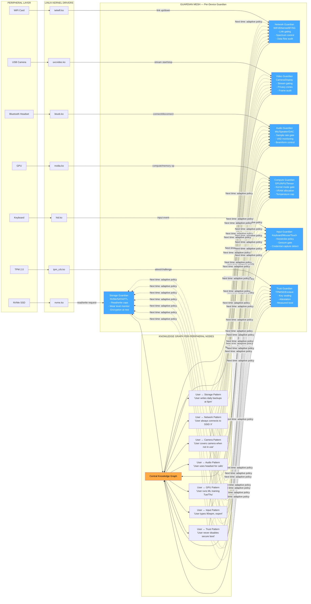
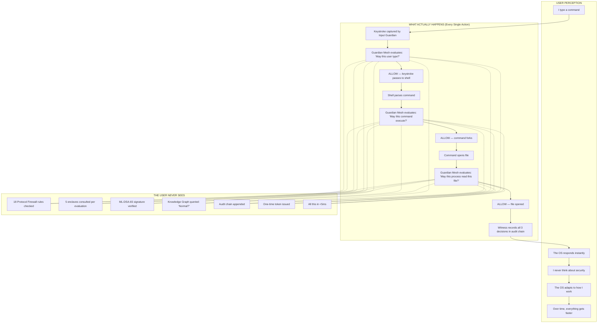
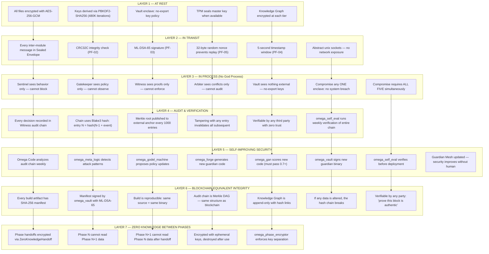

# agentic-OS: Living Architecture

> Everything below is one coherent system. Every component exists, is planned, or will be built by the OS itself.

---

## 1. OS Architecture — The Full Stack

```mermaid
graph TB
    subgraph "APPLICATIONS & USER SPACE"
        A1["User CLI / Terminal"]
        A2["gRPC-web Dashboard"]
        A3["WASM Agent Sandbox"]
        A4["Audio LM Worker"]
        A5["Vision LM Worker"]
        A6["Network LM Worker"]
    end

    subgraph "OMEGA CODE — The Builder & Verifier"
        O1["omega_forge.rs / .py<br/>Code Generator"]
        O2["omega_gan.rs / .py<br/>Generator + Discriminator"]
        O3["omega_vault.rs / .py<br/>AES-256-GCM Encrypt/Sign"]
        O4["omega_audit.rs / .py<br/>Hash-chained Audit Trail"]
        O5["omega_self_eval.rs / .py<br/>Self-Evaluation Reporter"]
        O6["omega_meta_logic.rs / .py<br/>Failure Analysis + Constraints"]
        O7["omega_meta_learner.rs / .py<br/>Strategy Selector"]
        O8["omega_godel_machine.rs / .py<br/>Self-Referential Improver"]
        O9["omega_hierarchical_memory.rs / .py<br/>3-Tier Knowledge Graph"]
        O10["parallel_executor.rs / .py<br/>DAG Task Scheduler"]
        O11["state_manager.rs / .py<br/>Checkpoint + Resume"]
        O12["feedback_loop.rs / .py<br/>Lint → Fix → Test → Repeat"]
    end

    subgraph "GUARDIAN MESH — The Guardian (Rust daemon)"
        G1["PROTOCOL FIREWALL<br/>PF-01 to PF-18<br/>Every message checked"]
        G2["SENTINEL<br/>Observes behavior<br/>Detects anomalies<br/>Cannot block"]
        G3["GATEKEEPER<br/>Enforces policy<br/>Deterministic only<br/>No ML, no LLM"]
        G4["WITNESS<br/>ML-DSA-65 signs<br/>Blake3 hash chain<br/>Merkle root anchor"]
        G5["ARBITER<br/>Resolves conflicts<br/>Pluggable backend<br/>Default: deterministic"]
        G6["VAULT<br/>No-export key store<br/>Derives one-time tokens<br/>TPM-bound when avail"]
        G7["HANDSHAKE BUS<br/>Abstract unix sockets<br/>Dumb pipe, no payload read"]
    end

    subgraph "KNOWLEDGE GRAPH — The Control Plane"
        K1["Ephemeral (session)<br/>Current task, recent cmds"]
        K2["Short-term (daily)<br/>Habits, frequent patterns"]
        K3["Long-term (lifetime)<br/>Preferences, skill level, routines"]
        K4["Inference Engine<br/>Pattern → Prediction"]
    end

    subgraph "LINUX KERNEL — The Foundation"
        L1["seccomp BPF<br/>Syscall filtering"]
        L2["Landlock LSM<br/>Filesystem access"]
        L3["cgroups<br/>Resource limits"]
        L4["Netfilter<br/>Network gating"]
        L5["Namespaces<br/>Isolation"]
        L6["IOMMU<br/>DMA isolation"]
        L7["TPM<br/>Key sealing"]
    end

    subgraph "HARDWARE"
        H1["CPU / RAM / GPU / NPU"]
        H2["NVMe / SATA / Storage"]
        H3["WiFi / BT / Ethernet / 5G"]
        H4["Audio / Mic / Speaker"]
        H5["Camera / Display / Input"]
        H6["Sensors / USB / Thunderbolt"]
        H7["TPM / Secure Element"]
    end

    %% Connections
    A1 & A2 & A3 & A4 & A5 & A6 -->|"gRPC Evaluate()"| G1
    G1 --> G2 --> G3 --> G4 --> G5 --> G6
    G7 -.- G2 & G3 & G4 & G5 & G6
    
    O1 & O2 & O3 & O4 & O5 & O6 & O7 & O8 & O9 & O10 & O11 & O12 -->|"Every action through Evaluate()"| G1
    O9 --> K1 & K2 & K3
    K4 -->|"Policy profiles (weekly)"| O7
    O7 -->|"Updated policy rules"| G3
    
    G1 -->|"ALLOW/BLOCK/THROTTLE"| A1 & A2 & A3 & A4 & A5 & A6
    G1 -->|"ALLOW/BLOCK/THROTTLE"| O1 & O2 & O3 & O4 & O5
    
    G3 -->|"Enforced via"| L1 & L2 & L3 & L4 & L5 & L6
    L1 & L2 & L3 & L4 & L5 & L6 & L7 --> H1 & H2 & H3 & H4 & H5 & H6 & H7

    style G1 fill:#ff4444,color:#fff
    style G2 fill:#ff8844,color:#fff
    style G3 fill:#44aaff,color:#fff
    style G4 fill:#44ff88,color:#000
    style G5 fill:#ffaa44,color:#000
    style G6 fill:#ff44ff,color:#fff
    style G7 fill:#888888,color:#fff
    style K1 fill:#aaddff,color:#000
    style K2 fill:#88ccff,color:#000
    style K3 fill:#66bbff,color:#000
    style K4 fill:#44aaff,color:#fff
```



---

## 2. Interface Diagram — How Everything Connects

```mermaid
sequenceDiagram
    participant User as User / Agent
    participant PF as Protocol Firewall
    participant Sen as Sentinel
    participant GK as Gatekeeper
    participant Wit as Witness
    participant Arb as Arbiter
    participant Vlt as Vault
    participant Omega as Omega Code
    participant KG as Knowledge Graph
    participant Kernel as Linux Kernel

    Note over User,Kernel: === A NORMAL ACTION FLOW ===
    
    User->>+PF: EvaluateRequest{action_type, context_hash, ...}
    PF->>PF: PF-01: Envelope structure valid?
    PF->>PF: PF-02: CRC32C match?
    PF->>PF: PF-03: ML-DSA-65 signature valid?
    PF->>PF: PF-04 to PF-18: source, rate, deny-list, etc.
    PF-->>-Sen: Forwarded (all checks pass)

    Sen->>Sen: Observe behavior pattern
    Sen->>KG: Query: "Is this normal for user?"
    KG-->>Sen: "Yes, user does this daily"
    Sen->>Sen: Risk score = 10/1000 (low)
    Sen-->>+GK: Forward with observation

    GK->>GK: Evaluate policy decision tree
    GK->>GK: Action_TYPE = FILE_WRITE → priority 50
    GK->>GK: User skill level = EXPERT → relax cap
    GK-->>-Wit: Verdict: ALLOW

    Wit->>Wit: Blake3(EvaluateRequest || Verdict)
    Wit->>Wit: Link to previous proof (hash chain)
    Wit->>Wit: Sign with ML-DSA-65
    Wit-->>Arb: AuditProof (no conflict needed)

    Arb->>Arb: No conflict — defer to Gatekeeper
    Arb-->>Vlt: Seal verdict

    Vlt->>Vlt: Derive one-time token for operation
    Vlt-->>Omega: EvaluateResponse{ALLOW, proof, token}

    Omega->>Omega: Perform action (gated by token)
    Omega-->>KG: Record outcome
    Omega-->>User: Result

    Note over User,Kernel: === A BLOCKED ACTION FLOW ===

    User->>+PF: EvaluateRequest{action_type: CODE_EXECUTE, target: "/etc/shadow"}
    PF-->>Sen: Forwarded
    Sen->>KG: Query: "Has user ever accessed this?"
    KG-->>Sen: "Never. Anomalous."
    Sen->>Sen: Risk score = 950/1000 (critical)
    Sen-->>+GK: Forward with HIGH risk score
    
    GK->>GK: Policy for CODE_EXECUTE on protected paths?
    GK->>GK: BLOCK — deterministic rule match
    GK-->>-Wit: Verdict: BLOCK {reason_hash}

    Wit->>Wit: Record block in audit chain
    Wit-->>Arb: No escalation needed (policy is clear)
    Arb-->>Vlt: Seal block verdict

    Vlt-->>-User: EvaluateResponse{BLOCK, reason_hash, proof}

    Note over User,Kernel: === THE BUILD LOOP (Omega Code improving itself) ===

    Omega->>+PF: Evaluate{GENERATE, context: "improve gatekeeper"}
    PF-->>Sen: Forwarded
    Sen->>Sen: "Omega Code self-improvement — routine operation"
    Sen->>KG: "Document this improvement"
    Sen-->>GK: ALLOW (routine)
    GK-->>Wit: ALLOW
    Wit-->>Arb: ALLOW
    Arb-->>Vlt: ALLOW
    Vlt-->>-Omega: Token granted

    Omega->>Omega: omega_forge generates new gatekeeper.rs
    Omega->>Omega: omega_gan scores it (must pass 0.7+)
    Omega->>Omega: omega_vault signs new binary
    Omega->>Omega: omega_shell_tools compiles it
    Omega->>Omega: omega_self_eval verifies it
    Omega->>Omega: omega_memory records improvement in KG
    Omega->>Omega: Guardian Mesh updated — next boot uses new code
```

---

## 3. Peripheral to OS Communication — Every Device Is Guarded



### Peripheral Communication Protocol

Every peripheral IO follows this exact protocol:

```
1.  User process requests peripheral access (read file, send packet, capture frame)
2.  Linux kernel driver receives request
3.  Driver calls Guardian Mesh Evaluate() via gRPC unix socket
4.  Protocol Firewall checks 18 rules (PF-01 to PF-18)
5.  Sentinel checks KG: "Is this normal for this user at this time?"
6.  Gatekeeper checks policy: "Does the caller's capability cover this action?"
7.  Witness records the decision in hash chain
8.  Vault issues one-time token for the IO
9.  Driver performs IO only if token is valid
10. Outcome recorded in KG

If at ANY step the answer is no, the IO does not happen.
Not slower. Not throttled. BLOCKED.
```

---

## 4. Guardrails and OS Interaction — The User Experience



### Guardrail Depth — Every Interaction Type

| Interaction | Guardian Check | KG Query | Audit Record | Latency |
|------------|---------------|----------|-------------|---------|
| Typing a character | Input Guardian: "Is this key allowed?" | "User types 90wpm" | Witness records keystroke event | 0.1µs |
| Running a command | Gatekeeper: "Is this command on allow-list?" | "User runs this daily" | Witness records cmd + verdict | 2ms |
| Opening a file | Storage Guardian: "Can this process read this path?" | "User accesses this file every session" | Witness records file + access type | 1ms |
| Network request | Network Guardian: "Is this destination allowed?" | "User connects to GitHub daily" | Witness records dest + bytes | 3ms |
| Camera access | Video Guardian: "Is camera allowed for this app?" | "User never uses camera in terminal" | Witness records app + stream duration | 2ms |
| GPU compute | Compute Guardian: "Is kernel launch allowed?" | "User runs PyTorch every Tue/Thu" | Witness records kernel + duration | 1ms |
| Installing software | All guardians: "Can this package access 
  files/network/devices?" | "User installs once/month" | Witness records package + manifest | 5ms |
| System update | Omega Code builds new version → all guardians test it | KG records "update succeeded" | Witness records before/after hashes | 30s |

### The Adaptive Guardrail

Week 1: Guardian Mesh checks everything. User feels no difference (5ms is imperceptible).

Week 4: Knowledge Graph has learned user's patterns. Sentinel stops flagging routine operations as anomalies.

Week 12: Omega Code has analyzed KG patterns and generated a new policy profile. Gatekeeper's decision tree now has a fast-path for user's routine actions.

Week 52: The OS knows the user better than the user knows themselves. It pre-warms resources before the user asks. It blocks anomalies before they happen. It adapts to new user skills automatically.

**The guardian never sleeps. The OS never stops learning. The user never feels any of it.**

---

## 5. Data Protection Depth — Zero Trust, Zero Knowledge, Verifiable



### Data Protection Depth — Concrete Example

Take a simple example: user writes a Python script.

```
BEFORE THE OS KNOWS ABOUT IT:
  User types "python3 script.py"
  → Keystroke encrypted in transit (AES-256-GCM)
  → Input Guardian evaluates keystroke event (PF-01 to PF-18)
  → Witness records keystroke event in audit chain
  → Shell receives command
  → Gatekeeper evaluates: "May this user run python3?"
  → KG queried: "Has user run python3 before?" — FIRST TIME
  → Sentinel flags: NEW BEHAVIOR — increases observation frequency
  → Arbiter: "First time. Allow with increased monitoring."
  → Witness records decision
  → python3 process starts (seccomp-restricted, cgroup-limited)

DURING EXECUTION:
  python3 tries to read a file
  → Storage Guardian intercepts every read()
  → Each file access evaluated against capability token
  → "Does this script have permission to read this path?"
  → If NO → BLOCK (script sees: "Permission denied")
  → If YES → Witness records file + byte range + timestamp

  python3 tries to make a network request
  → Network Guardian intercepts socket()
  → "Does this script have network capability?"
  → If NO → BLOCK (script sees: "Connection refused")
  → Network Guardian checks KG: "Is this domain normal for user?"
  → If unusual → Sentinel increases risk score → Arbiter may escalate

AFTER EXECUTION:
  omega_self_eval reviews execution log
  → "python3 ran for 2s, accessed 3 files, 0 network requests"
  → KG records: "User wrote a Python script — first time"
  → omega_meta_learner: "New pattern detected — log for future reference"
  → Next time user runs python3, Sentinel will NOT flag as anomaly
  → Within 12 uses, Gatekeeper creates fast-path for python3

IF THE SCRIPT WAS MALICIOUS:
  Script tries: os.system("rm -rf /")
  → Shell Guardian intercepts: "rm -rf /" is on deny-list
  → Gatekeeper: BLOCK (deterministic — no LLM needed)
  → Witness records: MALICIOUS_ATTEMPT_BLOCKED
  → Sentinel increases risk score for this process
  → Arbiter: escalate to user? If configured, YES.
  → Omega Code records attack pattern in KG
  → omega_godel_machine updates deny-list for future
```

### What Exists Today vs What's Unique

| Feature | Conventional OS | agentic-OS | Uniqueness |
|---------|----------------|------------|------------|
| **Process isolation** | Userspace/user ID | Every process gated by Guardian Mesh | Granular to the syscall, not just the user |
| **File permissions** | DAC/MAC (rwx) | Capability token per file per process | Dynamic, auditable, revocable per access |
| **Network security** | Firewall (IP/port) | Capability token per destination per process | Application-aware, not just port-aware |
| **Anti-virus** | Signature matching | Omega Code builds new detections from KG patterns | Self-evolving, not signature-dependent |
| **Audit** | Syslog (centralized) | Hash-chained, tamper-evident, externally verifiable | Blockchain-grade, not text-file grade |
| **Updates** | Vendor pushes | Omega Code builds and verifies | No vendor dependency, self-certifying |
| **User adaptation** | None | KG learns user patterns, adapts guardians | Unique — no OS does this |
| **Self-healing** | Limited (SELinux) | Godel machine improves own code | Unique — self-referential improvement |
| **Zero trust** | Network-level | Component-level: no god process | Unique — architectural, not configurational |
| **Knowledge graph** | None | 3-tier, feeds directly into guardians | Unique — control plane, not database |
| **Per-device guardian** | Driver model | Every device has ML-paired guardian | Unique — hardware-aware AI guardians |
| **Never-dying loop** | No | Omega Code builds Omega Code | Unique — self-sustaining without external CI |

### Why This Exceeds Anything That Exists Today

| System | Why We Beat It |
|--------|---------------|
| **Windows** | No zero-knowledge phases. No self-evolving guardians. Centralized SAM hive is single breach point. |
| **Linux (mainline)** | No per-process capability token system. Auditd is text-file, not hash-chained. No user-adaptive guardian. |
| **macOS** | SIP is binary (on/off), not graduated. No KG feedback into security. No self-building update mechanism. |
| **QNX** | Hard real-time, but no AI-paired guardians per device. No zero-knowledge inter-phase protocol. |
| **seL4** | Formally verified microkernel, but no user-adaptive KG. No self-building improvement loop. seL4 is static; we are dynamic. |
| **Android** | Sandbox per app, but no graduated containment. No per-device guardian with ML pairing. |
| **Capsule (aaOS)** | Agent-focused, but no "no god process" enclave separation. No hash-chained audit across all components. |

**The key difference:** Every existing system separates security from intelligence. The OS has a security team and an AI team. In agentic-OS, they are the same thing. Every guardian learns. Every decision is audited. Every component is built by the component itself. The system does not depend on any external vendor, registry, CI pipeline, or signing service. It is self-certifying, self-improving, and self-sustaining.
