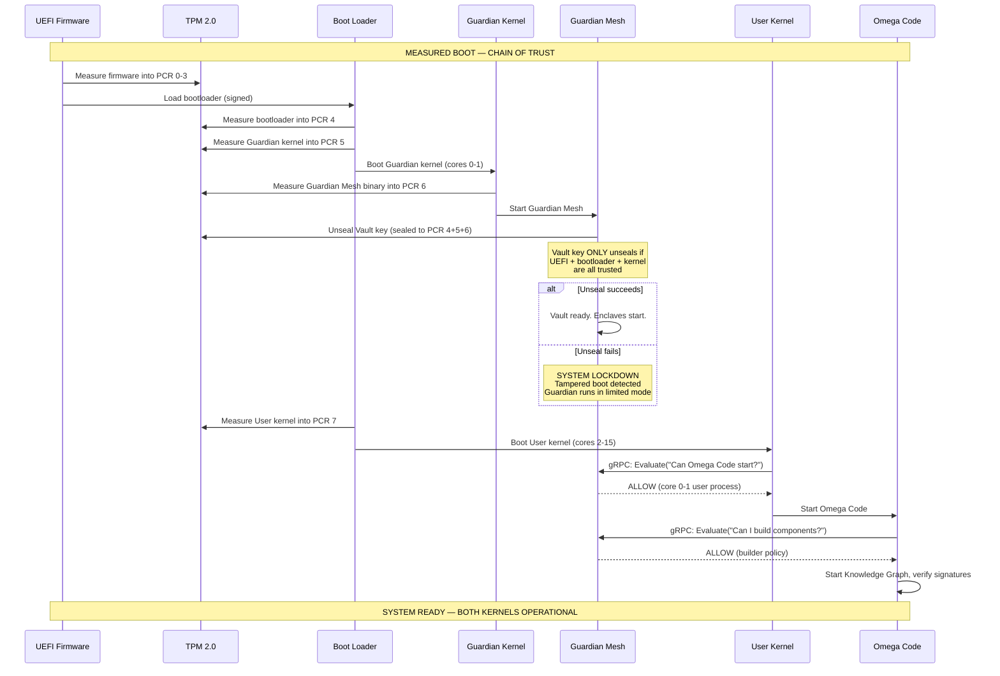
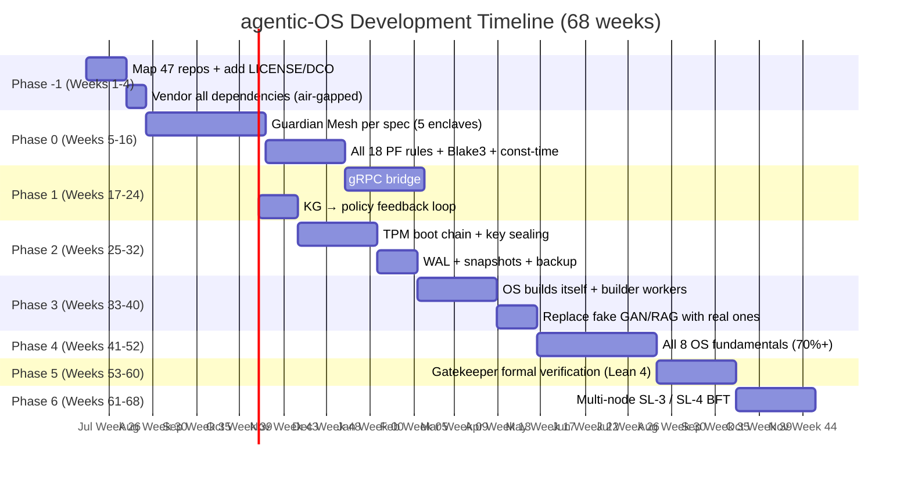

# agentic-OS: Product Operation Visual

> How the system runs on real hardware — laptops, servers, everywhere.

---

## 1. During Normal Operation

```mermaid
graph TB
    subgraph "CORE 0-1 | GUARDIAN MESH KERNEL (Minimal, RT, Verified)"
        GMK["Guardian Kernel<br/>seccomp + Landlock + IOMMU<br/>~8 syscalls, no drivers<br/>5MB, formally verified"]
        
        subgraph "GUARDIAN MESH DAEMON"
            G1["PROTOCOL FIREWALL<br/>18 rules checked"]
            G2["5 ENCLAVES<br/>Sentinel / Gatekeeper<br/>Witness / Arbiter / Vault"]
            G3["WITNESS CHAIN<br/>Blake3 Merkle tree<br/>ML-DSA-65 signed"]
        end
        
        GMK --> G1
        G1 --> G2
        G2 --> G3
    end

    subgraph "CORE 2-15 | USER KERNEL (Standard Linux)"
        UK["User Kernel<br/>Ubuntu / Arch / Fedora<br/>All drivers, all features<br/>50MB+"]
        
        subgraph "USER APPLICATIONS"
            UA1["VS Code / Chrome / Terminal"]
            UA2["Docker / Podman / Virtual Machines"]
            UA3["Games / Media / Design Tools"]
        end
        
        subgraph "OMEGA CODE (Builder)"
            OC1["omega_forge - Code Generator"]
            OC2["omega_self_eval - Verifier"]
            OC3["omega_vault - Signer"]
        end
        
        subgraph "ECOSYSTEM SERVICES"
            ES1["Argent - WASM Agent Sandbox"]
            ES2["AxiomCode - Formal Verification"]
            ES3["Nexus - 55+ Search Providers"]
            ES4["Aetheris - Cloud Gateway"]
            ES5["LocalForge - Multi-Agent Workflow"]
        end
        
        UK --> UA1 & UA2 & UA3
        UK --> OC1 & OC2 & OC3
        UK --> ES1 & ES2 & ES3 & ES4 & ES5
    end

    subgraph "IOMMU / SECCOMP BPF (Hardware Gate)"
        IO["IOMMU<br/>DMA isolation between kernels<br/>Guardian Mesh controls all gates"]
        SC["seccomp BPF<br/>Every user syscall filtered<br/>against Guardian Mesh policy"]
    end

    OC1 & OC2 & OC3 & ES1 & ES2 & ES3 & ES4 & ES5 -->|"gRPC Evaluate()"| IO
    IO -->|"ALLOW / BLOCK / THROTTLE"| G1
    G1 -->|"Verdict"| IO
    IO -->|"Response"| OC1 & OC2 & OC3 & ES1 & ES2 & ES3 & ES4 & ES5

    subgraph "HARDWARE"
        HW1["CPU Cores 0-1<br/>Dedicated to Guardian"]
        HW2["CPU Cores 2-15<br/>User workload"]
        HW3["GPU / RAM / NVMe / WiFi / BT / USB / Audio / Display"]
    end

    GMK --> HW1
    UK --> HW2
    UK --> HW3
    GMK -.->|"IOMMU gates"| HW3
```



### What This Means For Daily Use

| What You Do | What User Kernel Does | What Guardian Mesh Does | You Notice |
|------------|----------------------|------------------------|------------|
| Open VS Code | Loads editor, reads files | Checks: "File read allowed?" → ALLOW | Nothing — instant |
| Save a file | Writes to disk | Checks: "Write to this path allowed?" → ALLOW | Nothing — instant |
| Run `sudo rm -rf /` | Shell executes | Checks: "Mass delete allowed?" → **BLOCK** | "Permission denied" |
| Install a new app | Package manager runs | Checks: "Can this binary load?" → ALLOW if trusted | Nothing — install proceeds normally |
| Connect to WiFi | Network stack negotiates | Checks: "Can this SSID connect?" → ALLOW | Nothing — connects normally |
| Browse a malicious site | Browser loads page | Checks: "Can the browser access this URL?" → **BLOCK** | "This site cannot be reached" |
| Build a kernel module | `make` runs | Checks: "Can Omega Code compile kernel code?" → ALLOW | Build proceeds |
| OOM happens | Kernel kills a process | Records in Witness chain. KB analyzes pattern. | App may crash. Guardian learns. |
| Power is lost | Kernel halts | Guardian flushes audit chain to disk. Next boot: TPM verifies nothing tampered. | Black screen. Next boot: verified. |

**The user kernel never asks for permission on every keystroke.** It asks for permission on every **security-relevant action**: file writes outside the user's home directory, network connections to unknown hosts, process privilege escalations, kernel module loading, device access — these are the ~12 action types the Guardian Mesh controls.

---

## 2. Boot Sequence



---

## 3. The Build Flow (How We Get There)



---

## 4. What You See vs What the Guardian Sees

### Laptop User Experience

```
YOUR SCREEN (user kernel):
  ┌──────────────────────────────────────────────────────────┐
  │ Ubuntu Desktop                                            │
  │  [VS Code] [Chrome] [Terminal] [Discord]                 │
  │                                                           │
  │  You write code. You browse the web. You install apps.   │
  │  You never think about the guardian. It's invisible.     │
  │                                                           │
  │  Only when you do something dangerous:                    │
  │  "agentic-OS blocked rm -rf / — operation not permitted" │
  └──────────────────────────────────────────────────────────┘

BEHIND THE SCREEN (guardian kernel, invisible to user):
  ┌──────────────────────────────────────────────────────────┐
  │ Guardian Mesh (cores 0-1, isolated memory, no drivers)    │
  │                                                           │
  │  Every few microseconds:                                  │
  │  → Evaluate("Chrome wants to connect to google.com")     │
  │    → PF-01 to PF-18: ALL PASS                            │
  │    → Sentinel: "This domain is in user's bookmarks"      │
  │    → Gatekeeper: "NETWORK_REQUEST → ALLOW"               │
  │    → Witness: recorded in Blake3 chain                   │
  │    → Response < 5µs                                      │
  │                                                           │
  │  Every few days:                                          │
  │  → Omega Code analyzes KG: "User runs `cargo build`      │
  │    at 2pm every Tuesday. Pre-warm resources."            │
  │  → Generates updated policy: "fast-path for cargo"      │
  │  → Signs with Vault, deploys to Gatekeeper              │
  │                                                           │
  │  Every boot:                                              │
  │  → TPM measures: firmware + bootloader + kernels         │
  │  → Vault unseals keys ONLY if chain is trusted          │
  │  → If tampered: LOCKDOWN — "system integrity failed"    │
  └──────────────────────────────────────────────────────────┘
```

### Server Operator Experience

```
YOUR TERMINAL (SSH into server):
  $ systemctl status agentic-os
  ● agentic-os — Self-sustaining OS node
     Status: OPERATIONAL (SL-3 Verified mode)
     Uptime: 127d 14h 32m
     CPU: Guardian 2%, User 34%
     Memory: Guardian 128MB / 2GB allocated, User 24GB / 96GB
     Audit integrity: VERIFIED (chain 0..892341 intact)
     
  $ guardian-mesh health
  Enclave           Status   Verdicts   Last Error
  Sentinel          HEALTHY   892,341    —
  Gatekeeper        HEALTHY   892,341    —
  Witness           HEALTHY   892,341    —
  Arbiter           HEALTHY         3    —
  Vault             HEALTHY           —  —

  $ guardian-mesh verify-proof --id 892341
  Proof 892341: VALID
    Chain: 892340 → 892341 (gap: 0)
    Merkle root: 3a1b... (anchored to external store)
    Decision: ALLOW, action: BUILD, component: guardian-meshd
    Signature: ML-DSA-65, key: signing.guardian-mesh.2026-06
```

---

## 5. Summary

| Property | Answer |
|----------|--------|
| **What runs on your laptop?** | Ubuntu (or any distro) with Guardian Mesh on isolated cores |
| **What runs on servers?** | Same — Ubuntu + Guardian Mesh, or minimal OS + Guardian Mesh |
| **Do you develop on a special OS?** | No. Whatever you use today. Ubuntu, Arch, Fedora, macOS. |
| **Does the guardian slow things down?** | No. The guardian uses separate CPU cores. User gets 14 of 16 cores at full speed. |
| **What happens if guardian finds malware?** | Gatekeeper blocks the action. Witness records it. Sentinel updates anomaly baseline. |
| **What happens if guardian is compromised?** | Only 2 cores affected. User kernel still runs. No god process — attacker must compromise 5 enclaves. |
| **Can you turn the guardian off?** | No. The hardware enforces it (IOMMU). It runs from boot. LOCKDOWN only.
