# Agentic-OS System Flows

Complete flow diagrams showing request lifecycle, component interactions, and data paths.

---

## Table of Contents
1. [User Request Flow](#1-user-request-flow)
2. [Planning to Execution Bridge](#2-planning-to-execution-bridge)
3. [Recursive Loop Flow](#3-recursive-loop-flow)
4. [Cognitive Engine Flow](#4-cognitive-engine-flow)
5. [Memory & Knowledge Flow](#5-memory--knowledge-flow)
6. [Security & Access Flow](#6-security--access-flow)
7. [Observability Flow](#7-observability-flow)

---

## 1. User Request Flow

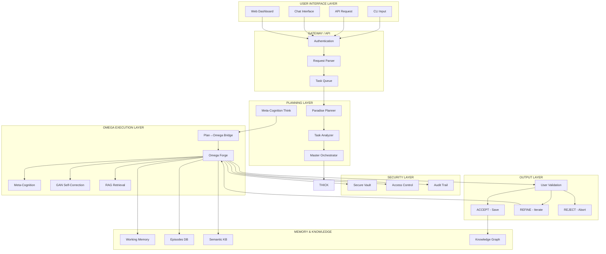

### Request Flow Description

| Step | Component | Description |
|------|-----------|-------------|
| 1 | User Input | User submits request via CLI/API/Chat |
| 2 | Authentication | Verify user identity and permissions |
| 3 | Request Parsing | Parse natural language into structured task |
| 4 | Task Queue | Queue task for async processing |
| 5 | Paradise Planner | Analyze codebase, detect patterns, generate plan |
| 6 | Master Orchestrator | Coordinate PDCA loops, orchestrate teams |
| 7 | Meta-Cognition | Think about the thinking, strategy selection |
| 8 | Plan→Omega Bridge | **CRITICAL: Convert plan to Omega execution context** |
| 9 | Omega Forge | Run recursive loop (RECOLLECT→RECTIFY→VERIFY→PERSIST) |
| 10 | User Validation | Present results for user acceptance |
| 11 | Finalize | Save to memory, graph, git |

---

## 2. Planning to Execution Bridge

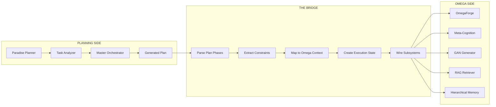

### Bridge Data Contract

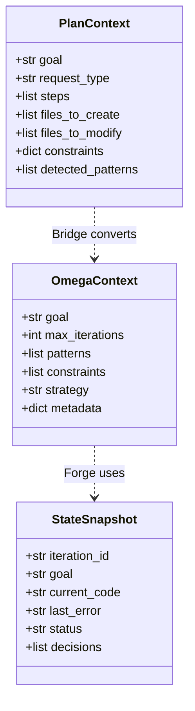

### Bridge Handshake Protocol

```
┌─────────────────────────────────────────────────────────────────────┐
│                    PLAN → OMEGA HANDSHAKE                            │
├─────────────────────────────────────────────────────────────────────┤
│                                                                      │
│  PLANNING                          BRIDGE                      OMEGA  │
│  ───────                          ──────                      ─────  │
│                                                                      │
│  ┌─────────────┐                   ┌─────────────┐          ┌─────────────┐
│  │ Plan JSON   │                   │ Parse &     │          │ State       │
│  │ {           │ ───────────────► │ Transform   │ ───────► │ Snapshot    │
│  │   goal      │                   │ PlanContext │          │ {           │
│  │   steps     │                   │      ↓      │          │   iteration │
│  │   files     │                   │ OmegaContext│          │   goal      │
│  │   type      │                   │             │          │   code      │
│  │ }           │                   └─────────────┘          │   status   │
│  └─────────────┘                                             │ }          │
│                                                               └─────────────┘
│                                                                      │
│  ◄─── ACK with context_id ────►                            ◄─── Start ───►
│                                                                      │
└─────────────────────────────────────────────────────────────────────┘
```

---

## 3. Recursive Loop Flow

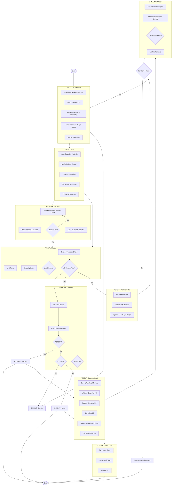

### Loop Termination Conditions

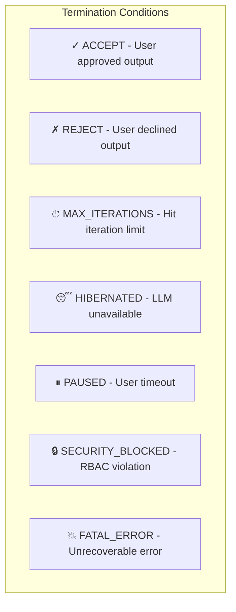

| Condition | Action | User Notification |
|-----------|--------|-------------------|
| ACCEPT | Save, commit, notify | "Goal achieved!" |
| REJECT | Abort, log reason | "Request cancelled" |
| MAX_ITERATIONS | Save state, pause | "Max attempts reached" |
| HIBERNATED | Save state, retry later | "LLM unavailable, retrying..." |
| PAUSED | Persist state | "Request paused" |
| SECURITY_BLOCKED | Block, audit | "Permission denied" |
| FATAL_ERROR | Rollback, alert | "Critical error occurred" |

---

## 4. Cognitive Engine Flow

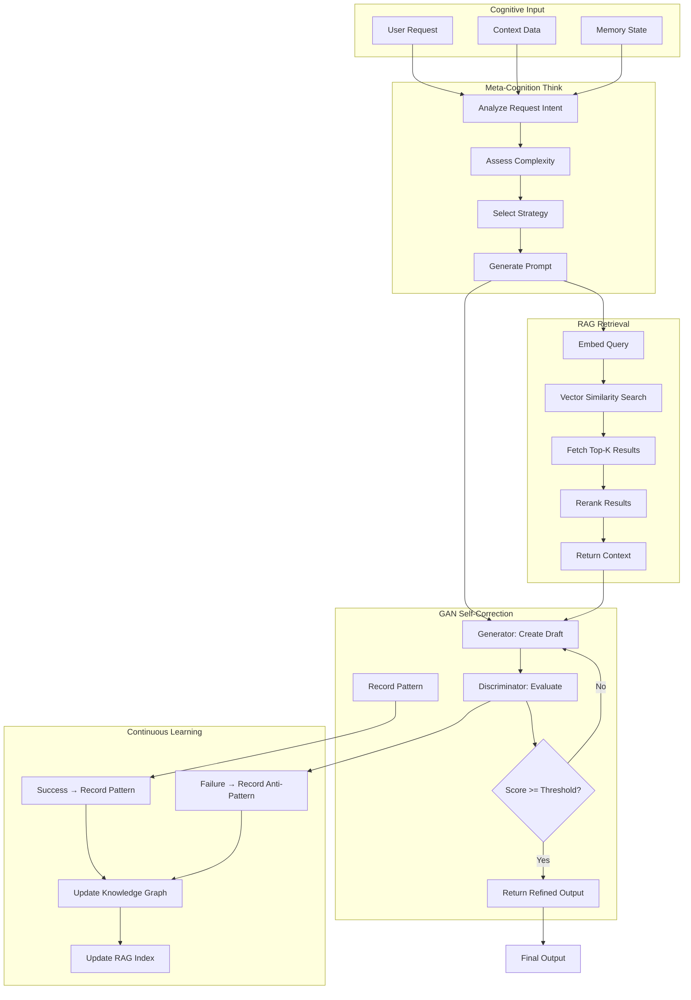

### GAN Self-Correction Loop

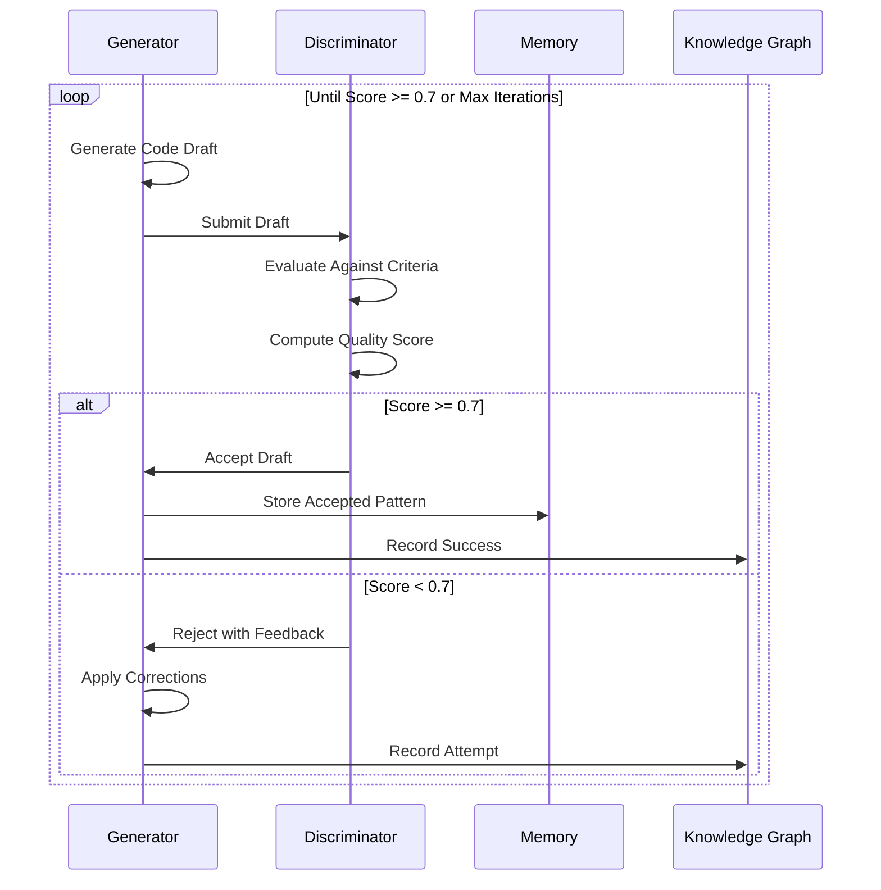

---

## 5. Memory & Knowledge Flow

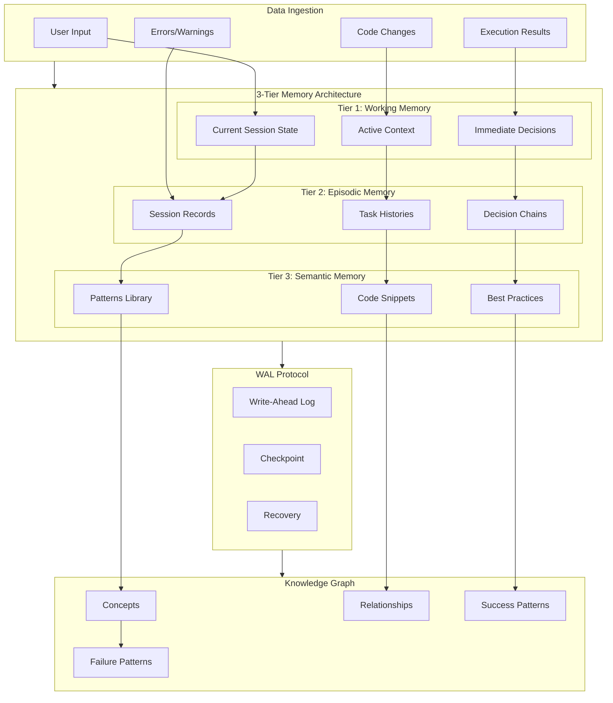

### Knowledge Graph Entity Relationships

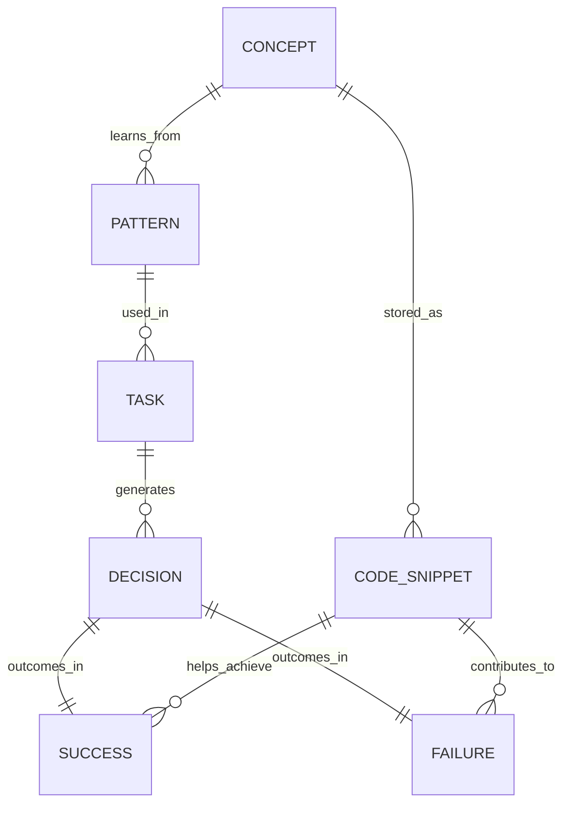

---

## 6. Security & Access Flow

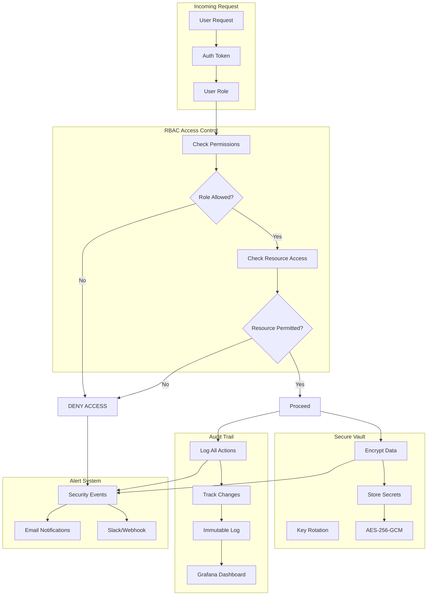

---

## 7. Observability Flow

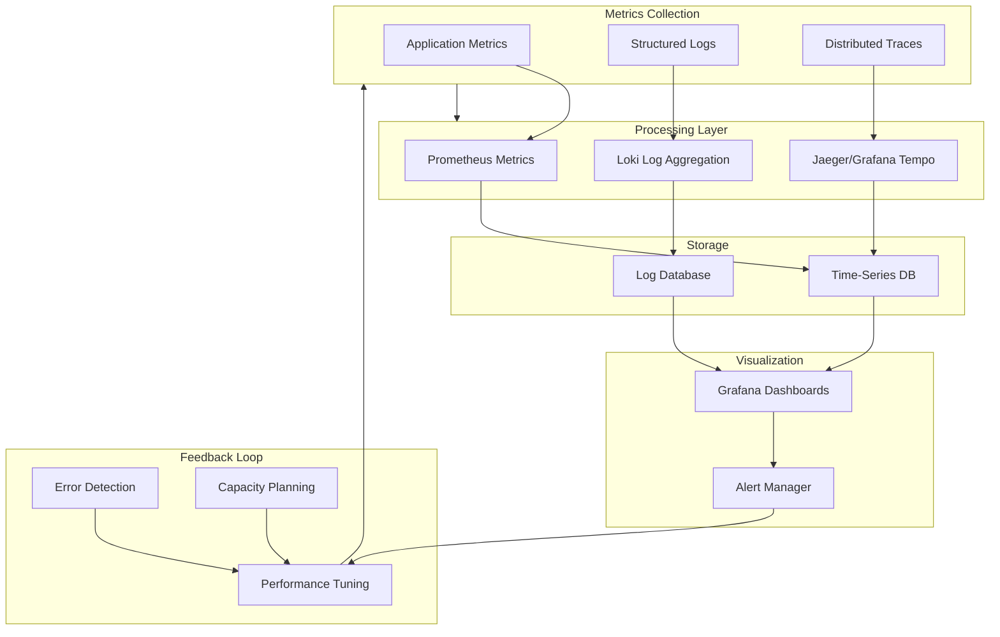

---

## Summary: Complete System Architecture

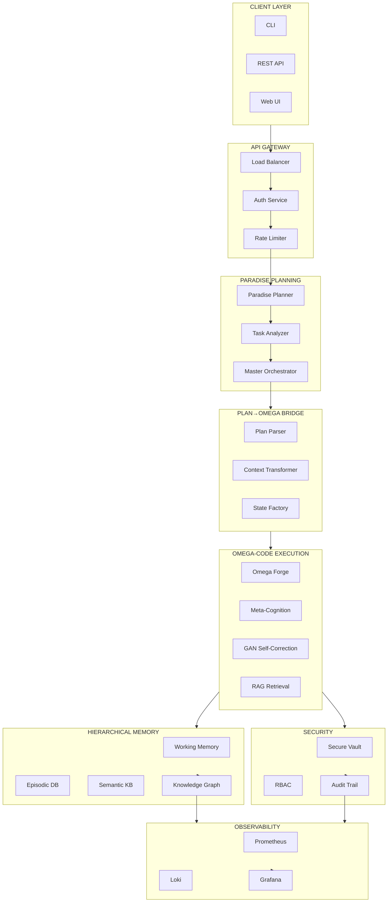

---

## Next: Component Handshakes

See [COMPONENT_HANDSHAKES.md](COMPONENT_HANDSHAKES.md) for detailed protocol specifications.
